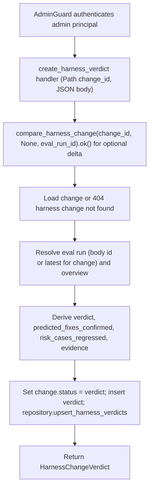

# POST /v1/admin/harness/evolution/changes/{change_id}/verdict

## Summary
Record an evolution verdict for a harness change. The store computes a before/after eval delta when baseline and candidate runs are available, otherwise falls back to a heuristic derived from the resolved eval run status and overview. The derived verdict is written back onto the change's `status` and a `HarnessChangeVerdict` record is persisted.

## Handler
- Rust handler: `create_harness_verdict`
- Route registration: `src/routes.rs::build_router`
- Authentication: AdminGuard

## Path Parameters
| Name | Type | Description |
| --- | --- | --- |
| change_id | string | Harness change manifest the verdict applies to. |

## Query Parameters
None.

## JSON Body Parameters
Schema: `CreateHarnessChangeVerdictRequest` (all fields optional; an empty object `{}` is accepted)

| Field | Type | Requirement | Description |
| --- | --- | --- | --- |
| eval_run_id | string | Optional | Eval run to judge; when omitted the store falls back to the latest eval run recorded for the change. |
| observed_metric_deltas | any (JSON) | Optional | Observed metric deltas; when `null`, filled from the resolved run overview metrics, or `{}` when no overview exists. |
| created_by | string | Optional | Author label; defaults to `admin`. |

## Response
Schema: `HarnessChangeVerdict`

| Field | Type | Description |
| --- | --- | --- |
| id | string | Verdict identifier (`hverdict` prefix). |
| tenant_id | string | Owning tenant id. |
| change_id | string | Change this verdict applies to. |
| eval_run_id | string or null | Eval run backing the verdict (request value or latest for the change); omitted when none resolved. |
| verdict | string | Outcome: `keep`, `improve`, `rollback`, or `rollback_and_pivot`. Also written to the change's `status`. |
| predicted_fixes_confirmed | string[] | Predicted fixes confirmed by the delta, or the change's predicted fixes when the fallback run passed. |
| risk_cases_regressed | string[] | Risk cases observed to regress (from the delta risk matrix, or matched against fallback evidence text). |
| observed_metric_deltas | any (JSON) | Observed metric deltas (request value, overview metrics, or `{}`). |
| evidence | any (JSON) | Supporting evidence: `{ "delta": EvalDeltaReport }` when a delta was computed, otherwise a summary of change failure pattern, eval run status, and overview markdown. |
| created_by | string | Author; the request value or `admin`. |
| created_at | string (RFC3339) | Creation timestamp. |

## Errors and Access Rules
- Malformed JSON or missing required runtime fields returns 400.
- Owner-scoped endpoints return 403 when the authenticated principal cannot access the requested owner.
- Store, Meilisearch, or LLM failures are returned through the shared ApiError JSON envelope.
- Unknown `change_id` returns 404 (`harness change not found`).
- No eval run is required: when the delta cannot be computed (missing runs), the comparison error is swallowed and a heuristic verdict is produced from the resolved run/overview instead.
- Admin-only: requires a valid admin principal via `AdminGuard`; non-admin principals return 403 (`admin token required`) and missing or invalid bearer tokens return 401.

## Internal Logic Call Graph

