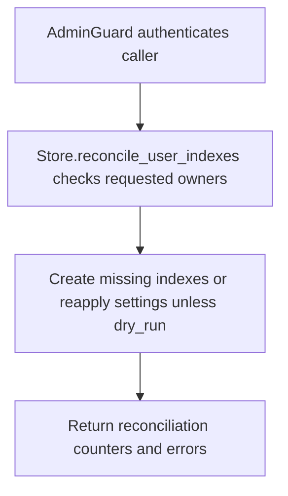

# POST /v1/admin/history/user-event-indexes:reconcile

## Summary
Reconcile owner event index metadata and backing Meilisearch settings.

## Handler
- Rust handler: `reconcile_user_event_indexes`
- Route registration: `src/routes.rs::build_router`
- Authentication: AdminGuard

## Path Parameters
None.

## Query Parameters
None.

## JSON Body Parameters
Schema: `ReconcileUserEventIndexesRequest`

| Field | Type | Requirement | Description |
| --- | --- | --- | --- |
| owner_user_ids | string[] | optional, default [] | Specific owners to reconcile. Empty means all known owner indexes. |
| dry_run | boolean | optional, default false | Report needed changes without creating indexes or reapplying settings. |
| reapply_settings | boolean | optional, default false | Force settings reconciliation on matching indexes. |
| create_missing | boolean | optional, default true | Create index metadata and backing indexes for missing owners. |

## Response
Schema: `ReconcileUserEventIndexesResponse`

| Field | Type | Description |
| --- | --- | --- |
| checked | integer | Number of owner index records checked. |
| created | integer | Number of missing indexes created. |
| updated_settings | integer | Number of indexes whose settings were updated. |
| errors | string[] | Non-fatal reconciliation errors. |
| indexes | UserEventIndex[] | Resulting index records. |

## Errors and Access Rules
- Malformed JSON or missing required runtime fields returns 400.
- Owner-scoped endpoints return 403 when the authenticated principal cannot access the requested owner.
- Store, Meilisearch, or LLM failures are returned through the shared ApiError JSON envelope.

## Internal Logic Call Graph

