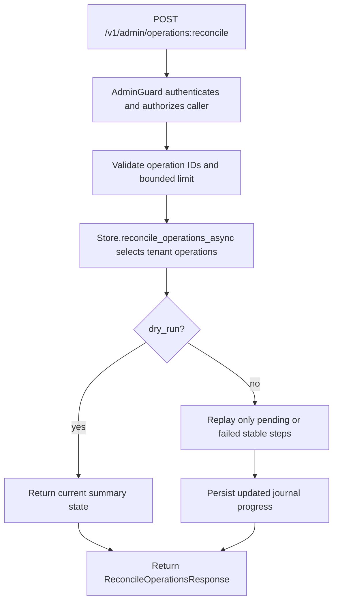

# POST /v1/admin/operations:reconcile

## Summary
Inspect or idempotently retry incomplete mutation-journal operations for the current tenant.

## Handler
- Rust handler: `reconcile_operations`
- Route registration: `src/routes.rs::build_router`
- Authentication: AdminGuard required

## Path Parameters
None.

## Query Parameters
None.

## JSON Body Parameters
Schema: `ReconcileOperationsRequest`

| Field | Type | Requirement | Description |
| --- | --- | --- | --- |
| operation_ids | string[] | optional, default [] | Reconcile only these operation IDs, fetched directly without scanning retained history. Values must be non-empty and at most 1,000 unique IDs may be supplied. Empty selects the tenant's currently reconcilable operations. |
| statuses | OperationStatus[] | optional, default [] | Restrict the selected operations to these journal states. Empty applies no status filter. A fully complete operation selected explicitly by ID is skipped. |
| limit | integer | optional, default 250; range 1-1,000 | Maximum number of matching operations to inspect. |
| dry_run | boolean | optional, default false | Report matching operation state without submitting persistence steps. |

## Response
Schema: `ReconcileOperationsResponse`

| Field | Type | Description |
| --- | --- | --- |
| checked | integer | Number of selected journal operations inspected. |
| reconciled | integer | Number of operations for which reconciliation work was attempted. |
| completed | integer | Number of operations confirmed complete after this request. |
| failed | integer | Number of operations that remain failed after this request. |
| skipped | integer | Number of selected operations requiring no action. |
| errors | OperationReconcileError[] | Per-operation safe error category and fingerprint; raw causes are never returned. |
| operations | OperationSummary[] | Summary-only post-reconciliation state. Replay plans are never echoed by this endpoint. |

## Errors and Access Rules
- Authentication is required; non-admin principals receive 403.
- The server tenant is always applied. Operation IDs from another tenant are not reconciled or disclosed.
- `limit=0` or a limit above 1,000 returns 400.
- Empty operation IDs or more than 1,000 unique operation IDs return 400.
- Targeted reconciliation fetches each requested ID directly. Untargeted reconciliation reads only the bounded active set, so retained completed history cannot exhaust the repository scan ceiling.
- Reconciliation is repeat-safe: stable operation and step IDs prevent successful work from being duplicated.
- `dry_run=true` performs no persistence retry and returns the selected summaries.
- Malformed JSON returns 400 through the shared `ApiError` envelope.
- Per-operation retry failures appear in `errors`; request-level store or Meilisearch failures use the shared envelope without raw causes.

## Internal Logic Call Graph

