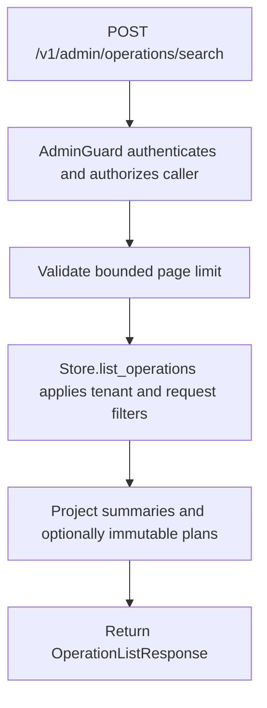

# POST /v1/admin/operations/search

## Summary
Search the current tenant's durable mutation journal without exposing replay payloads by default.

## Handler
- Rust handler: `search_operations`
- Route registration: `src/routes.rs::build_router`
- Authentication: AdminGuard required

## Path Parameters
None.

## Query Parameters
None.

## JSON Body Parameters
Schema: `OperationListRequest`

| Field | Type | Requirement | Description |
| --- | --- | --- | --- |
| statuses | OperationStatus[] | optional, default [] | Restrict results to the requested journal states. Empty means all states. |
| operation_kinds | string[] | optional, default [] | Restrict results to the named mutation kinds. Empty means all kinds. |
| limit | integer | optional, default 100; range 1-500 | Maximum number of operation records returned. |
| cursor | string? | optional | Opaque cursor from a previous response. |
| include_plan | boolean | optional, default false | Include each immutable replay plan. The default response contains summaries only. |

## Response
Schema: `OperationListResponse`

| Field | Type | Description |
| --- | --- | --- |
| operations | OperationListItem[] | Tenant-scoped operation summaries, optionally with immutable plans when `include_plan=true`. |
| next_cursor | string? | Opaque cursor for the next page when more matching records remain. |

Each `OperationListItem` flattens an `OperationSummary` containing the operation ID and kind, actor scope, idempotency-key hash when present, status, indexing state, attempt and step counts, timestamps, and safe error category/fingerprint fields. It never exposes raw error causes. The optional `plan` field is omitted unless explicitly requested by an admin.

## Errors and Access Rules
- Authentication is required; non-admin principals receive 403.
- The server tenant is always applied. Callers cannot select or cross tenant scope in the request body.
- `limit=0` or a limit above 500 returns 400.
- Malformed JSON returns 400 through the shared `ApiError` envelope.
- Store or Meilisearch failures use the shared error envelope and do not expose raw persistence causes.

## Internal Logic Call Graph

