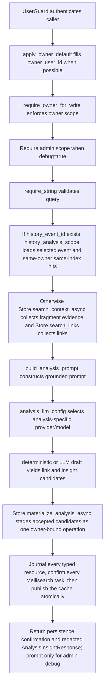

# POST /v1/analysis/insights

## Summary
Analyze context or a selected history event to propose and optionally persist links and insights. When history_event_id is supplied, only the selected owner event index is used.

## Handler
- Rust handler: `analyze_insights`
- Route registration: `src/routes.rs::build_router`
- Authentication: UserGuard; owner write scope required; `debug=true` requires admin

## Path Parameters
None.

## Query Parameters
None.

## JSON Body Parameters
Schema: `AnalysisInsightRequest`

| Field | Type | Requirement | Description |
| --- | --- | --- | --- |
| owner_user_id | string | optional normally; required when history_event_id is supplied | Owner scope for search, link creation, and insight upsert. |
| history_event_id | string | optional | When supplied, analysis is constrained to the selected event and other events from the same owner event index. |
| query | string | required by handler | Analysis question or topic. |
| seed_uris | string[] | optional, default [] | Extra seed context URIs used when not running in history_event_id mode. |
| context_limit | integer | optional, default 8 | Maximum context hits used in prompt construction; must not exceed `RAG_MAX_SEARCH_LIMIT`. |
| link_limit | integer | optional, default 10 | Maximum existing links considered; must not exceed `RAG_MAX_SEARCH_LIMIT`. |
| create_links | boolean | optional, default true | Persist proposed link candidates. |
| upsert_insights | boolean | optional, default true | Persist proposed insight candidates. |
| debug | boolean | optional, default false | Include prompt and debug-stage data where available; admin-only. |

## Response
Schema: `AnalysisInsightResponse`

| Field | Type | Description |
| --- | --- | --- |
| analysis_id | string | New analysis id. |
| query | string | Analysis query. |
| history_event_id | string? | Selected history event id when same-index mode was used. |
| event_index_uid | string? | Owner event index UID used for same-index history analysis. |
| context_hits | ContextHit[] | Context fragments or history hits used as evidence. |
| existing_links | KnowledgeLink[] | Existing links included in the analysis prompt. |
| link_candidates | LinkCandidate[] | Proposed links from deterministic or LLM analysis. |
| insight_candidates | InsightCandidate[] | Proposed insights from deterministic or LLM analysis. |
| created_links | KnowledgeLink[] | Links persisted when create_links is true. |
| insights | InsightRecord[] | Insights persisted when upsert_insights is true. |
| persistence | PersistenceMetadata? | Durable operation ID, completed operation/indexing states, and confirmed Meilisearch task UIDs when candidates were materialized. Omitted when no write was needed. |
| usage | object | Provider/model/backend metadata; includes history_scope same_index for history_event_id mode. Admin debug includes only safe candidate rejection codes. |
| prompt | string? | Configured-secret-redacted prompt included only when debug is true. |

## Errors and Access Rules
- Malformed JSON or missing required runtime fields returns 400.
- `context_limit` or `link_limit` above `RAG_MAX_SEARCH_LIMIT` returns 400
  `validation_error` naming that field before retrieval or persistence.
- Owner-scoped endpoints return 403 when the authenticated principal cannot access the requested owner.
- Authenticated non-admin principals receive 403 when `debug=true` because the response can contain a grounded prompt.
- Configured secrets are redacted from the complete response. Provider previews
  are redacted before they are truncated.
- Store, Meilisearch, or LLM failures are returned through the shared ApiError JSON envelope.
- history_event_id analysis requires owner_user_id after auth defaults are applied.
- Non-history context evidence uses the same default fragment-only context search as /v1/context/search.

## Internal Logic Call Graph

## Internal Logic Notes
- history_event_id mode resolves the selected event through Store.get_event_async(owner_user_id, history_event_id), searches only that owner routing, keeps hits whose event_index_uid matches the selected event, and reports usage.history_scope.mode = same_index.
- Provider output is untrusted. Strict validation applies exact authorized-URI
  membership, relation/score/field bounds, and first-valid-wins deduplication
  before any durable write.
- Link, insight, history, and ContextFS projection writes are committed through
  one HMAC owner-bound `analysis.materialize` operation. The response is not
  returned until every accepted Meilisearch task has completed successfully.
