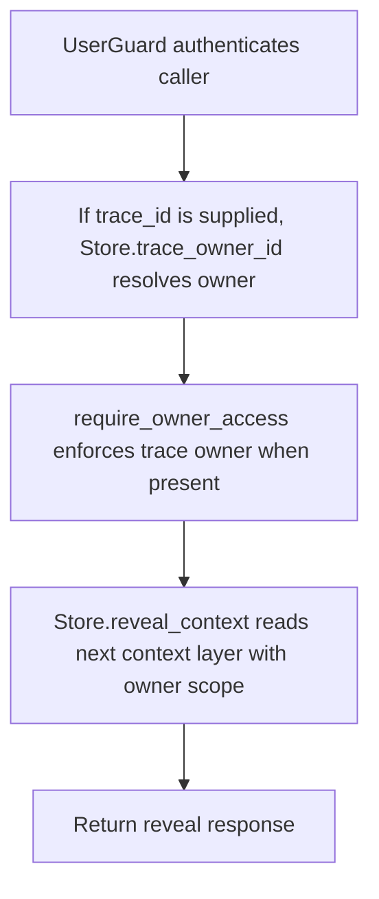

# POST /v1/context/reveal

## Summary
Reveal deeper content for a context URI, optionally deriving owner scope from a trace.

For fragments produced from source documents, use `/v1/context/traceback` to identify the full source document; reveal remains a layered context-node read.

## Handler
- Rust handler: `context_reveal`
- Route registration: `src/routes.rs::build_router`
- Authentication: UserGuard; trace owner enforced when trace_id resolves one

## Path Parameters
None.

## Query Parameters
None.

## JSON Body Parameters
Schema: `ContextRevealRequest`

| Field | Type | Requirement | Description |
| --- | --- | --- | --- |
| uri | string | optional | Context URI to reveal. |
| trace_id | string | optional | Trace used to derive owner scope for authorization. |
| next_layer | integer | optional | Layer to reveal next. |

## Response
Schema: `ContextRevealResponse`

| Field | Type | Description |
| --- | --- | --- |
| uri | string | Revealed context URI. |
| layer | integer | Revealed layer. |
| content | string | Context content. |
| source_ref | SourceRef | Source reference for the context node. |

## Errors and Access Rules
- Malformed JSON or missing required runtime fields returns 400.
- Owner-scoped endpoints return 403 when the authenticated principal cannot access the requested owner.
- Store, Meilisearch, or LLM failures are returned through the shared ApiError JSON envelope.

## Internal Logic Call Graph

