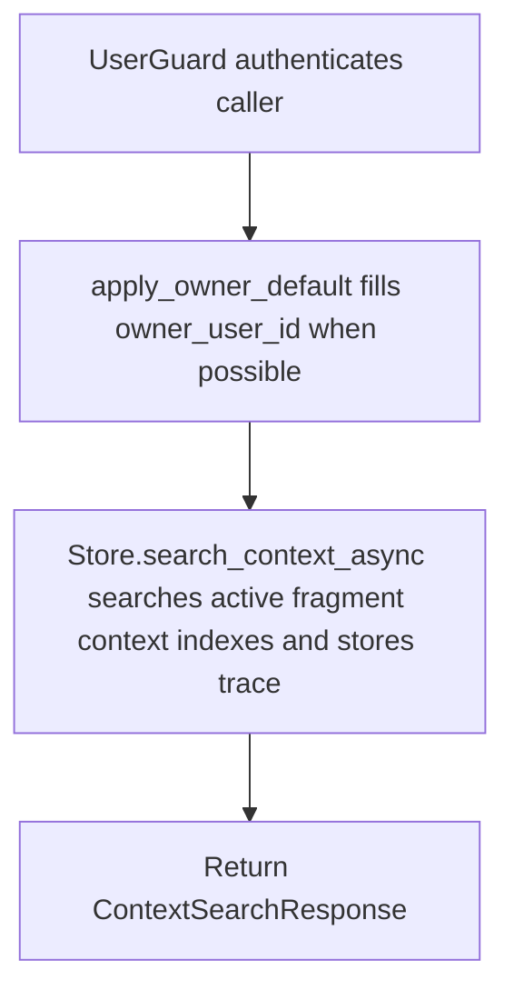

# POST /v1/context/search

## Summary
Search active retrieval fragments and create a trace for later reveal/debug operations. Raw source documents are excluded from default search.

## Handler
- Rust handler: `context_search`
- Route registration: `src/routes.rs::build_router`
- Authentication: UserGuard; owner default may apply

## Path Parameters
None.

## Query Parameters
None.

## JSON Body Parameters
Schema: `ContextSearchRequest`

| Field | Type | Requirement | Description |
| --- | --- | --- | --- |
| query | string | required | Search query matched against active fragments. |
| mode | string | optional, default auto | Search mode selector. |
| target_uri | string | optional | Target URI used by reveal-style searches. |
| filters | object | optional, default null | Structured filters passed to the context store. Default retrieval still enforces active fragment-only filtering. |
| owner_user_id | string | optional, auth default may apply | Owner scope. |
| limit | integer | optional, default 10 | Maximum context hits returned. |
| debug | boolean | optional, default false | Include stage details in the trace response. |

## Response
Schema: `ContextSearchResponse`

| Field | Type | Description |
| --- | --- | --- |
| trace_id | string | Trace id for reveal/debug. |
| hits | ContextHit[] | Matching fragment context hits. |
| stages | object[] | Search stage details. |

### ContextHit Fields
| Field | Type | Description |
| --- | --- | --- |
| uri | string | Fragment context URI. |
| title | string | Fragment title. |
| layer | integer | Context layer. |
| score | number | Retrieval score. |
| node_kind | string? | Usually `fragment` for default retrieval. |
| retrieval_role | string? | Usually `fragment` for default retrieval. |
| source_id | string? | Source identifier when the fragment came from a source document. |
| revision_id | string? | Source revision identifier when present. |
| source_document_uri | string? | Full source document URI for traceback/read operations. |
| fragment_index | integer? | Zero-based fragment index within the source document. |
| char_start | integer? | Fragment start character offset in the source document. |
| char_end | integer? | Fragment end character offset in the source document. |
| snippet | string | Search snippet from the matching fragment. |

## Errors and Access Rules
- Malformed JSON or missing required runtime fields returns 400.
- Owner-scoped endpoints return 403 when the authenticated principal cannot access the requested owner.
- Source documents with `retrieval_enabled=false` are not returned by default search.
- Store, Meilisearch, or LLM failures are returned through the shared ApiError JSON envelope.

## Internal Logic Call Graph

