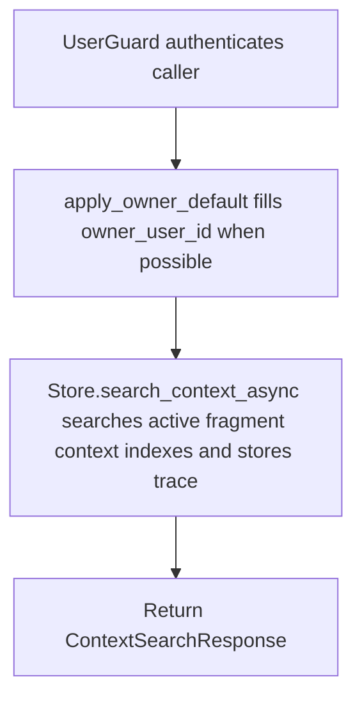

# POST /v1/context/search

## Summary
Search active retrieval fragments and create a trace for later reveal/debug operations. Raw source documents are excluded from default search, but standard and full responses include enough source/location provenance for UI highlighting and debugging.

## Handler
- Rust handler: `context_search`
- Route registration: `src/routes.rs::build_router`
- Authentication: UserGuard; owner default may apply

## Path Parameters
None.

## Query Parameters
None.

## JSON Body Parameters
Schema: `ContextSearchRequest`

| Field | Type | Requirement | Description |
| --- | --- | --- | --- |
| query | string | required | Search query matched against active fragments. |
| mode | string | optional, default auto | Search mode selector. |
| target_uri | string | optional | Target URI used by reveal-style searches. |
| filters | object | optional, default null | Structured filters applied on top of the active fragment-only retrieval filter. |
| include | string[] | optional, default [] | Optional payload expansions. Supported values: `traceback`, `links`, `neighbor_fragments`, `source_summary`, `artifact_refs`, `score_breakdown`, `raw_stage_debug`. |
| return_profile | string | optional, default standard | Response profile: `compact`, `standard`, or `full`. |
| owner_user_id | string | optional, auth default may apply | Owner scope. |
| limit | integer | optional, default 10 | Maximum context hits returned. |
| debug | boolean | optional, default false | Include stage details in the trace response. |

### Structured Filter Fields
| Field | Type | Description |
| --- | --- | --- |
| source_id | string | Keep fragments from a specific source id. |
| revision_id | string | Keep fragments from a specific source revision. |
| source_document_uri | string | Keep fragments belonging to a specific source document URI. |
| block_type | string | Keep fragments with a block type such as `text`, `table`, `image`, or `equation`. |
| page_idx | integer/string | Keep fragments on an exact page index. |
| page_idx_gte | integer/string | Keep fragments whose page index is greater than or equal to this value. |
| page_idx_lte | integer/string | Keep fragments whose page index is less than or equal to this value. |
| section_path_contains | string | Keep fragments whose section path contains the value, case-insensitive. |
| artifact_kind | string | Keep fragments that reference a parse artifact of this kind. |

## Response
Schema: `ContextSearchResponse`

| Field | Type | Description |
| --- | --- | --- |
| trace_id | string | Trace id for reveal/debug. |
| hits | ContextHit[] | Matching fragment context hits. |
| groups | ContextSourceGroup[] | Source-level groups for `standard` and `full` profiles. Empty or omitted for `compact`. |
| stages | object[] | Search stage details with sensitive backend fields redacted unless admin debug is enabled. |

### Return Profiles
| Profile | Description |
| --- | --- |
| compact | Minimal hit shape for lightweight callers: `uri`, `title`, `layer`, `score`, and `snippet`, plus explicitly requested include payloads where applicable. No source groups. |
| standard | Default profile. Returns fragment provenance, source/location/block fields, artifact references, and source groups without returning full source document bodies. |
| full | Standard fields plus source summaries, active `part_of` related links, and `source_relation=part_of`. Add `include: ["links"]` to include up to 5 non-`part_of` related links ordered by confidence and update time. |

### Include Behavior
| Include | Description |
| --- | --- |
| traceback | Adds `source_document_uri`, `source_title`, and `source_relation=part_of` to hits. Does not include the full source document body. |
| links | Adds lightweight `related_links` per hit: active `part_of` links plus up to 5 non-`part_of` links by confidence and `updated_at`. |
| neighbor_fragments | Adds adjacent fragments from the same active source document when available. |
| source_summary | Adds `source_summary` with source document URI, source id, revision id, and source title. |
| artifact_refs | Preserves `artifact_refs` in compact profile; standard/full include them when present. |
| score_breakdown | Adds a score breakdown object with `lexical` (substring score), `vector` (fragment-level turbovec similarity, when scored), `document_vector` (source-document-level turbovec similarity, when scored), and `combined` (the final blended score). |
| raw_stage_debug | Accepted as an include value; raw stage visibility is still controlled by `debug` and admin status. |

### ContextHit Fields
| Field | Type | Description |
| --- | --- | --- |
| uri | string | Fragment context URI. |
| title | string | Fragment title. |
| layer | integer | Context layer. |
| score | number | Hybrid retrieval score: lexical substring score blended with fragment-level and document-level turbovec vector similarity. |
| node_kind | string? | Usually `fragment` for default retrieval. |
| retrieval_role | string? | Usually `fragment` for default retrieval. |
| source_id | string? | Source identifier when the fragment came from a source document. |
| revision_id | string? | Source revision identifier when present. |
| source_document_uri | string? | Full source document URI for traceback/read operations. |
| source_title | string? | Title of the parent source document when known. |
| source_relation | string? | `part_of` when traceback/full source relation metadata is included. |
| fragment_index | integer? | Zero-based fragment index within the source document. |
| char_start | integer? | Fragment start character offset in the source document. |
| char_end | integer? | Fragment end character offset in the source document. |
| block_type | string? | Parser block type for source-derived fragments. |
| page_idx | integer? | Zero-based page index from parser metadata when available. |
| bbox | JSON? | Parser-provided bounding box for source highlighting when available. |
| section_path | string[] | Section hierarchy for the fragment. |
| heading_level | integer? | Heading level for heading-derived fragments. |
| asset_refs | string[] | Parser asset references, such as extracted image paths. |
| artifact_refs | ParseArtifactRef[] | Parse artifact references attached to the fragment. |
| checksum | string? | Fragment checksum. |
| source_summary | ContextSourceSummary? | Lightweight parent source metadata when requested or using `full`. |
| neighbor_fragments | ContextNeighborFragment[] | Adjacent source fragments when requested. |
| related_links | ContextRelatedLink[] | Lightweight related links when requested or using `full`. |
| score_breakdown | object? | Score details when requested: `lexical`, `vector`, `document_vector` (each when scored), and `combined`. |
| snippet | string | Search snippet from the matching fragment. |

### ContextSourceGroup Fields
| Field | Type | Description |
| --- | --- | --- |
| source_document_uri | string | Source document URI for the group. |
| source_id | string | Source id for the group. |
| revision_id | string | Source revision id for the group. |
| source_title | string | Source document title. |
| top_score | number | Highest hit score in the group. |
| hit_count | integer | Number of hits in the group. |
| page_range | object? | `{ "start": number, "end": number }` when page indexes are available. |
| block_types | string[] | Distinct block types represented by the group hits. |
| top_hit_uri | string | URI of the top hit for the group. |

## Errors and Access Rules
- Malformed JSON, unsupported `include`, unsupported `return_profile`, or invalid filter value types return 400.
- Owner-scoped endpoints return 403 when the authenticated principal cannot access the requested owner.
- Source documents with `retrieval_enabled=false` are not returned by default search.
- Default retrieval always enforces active fragments only: `status=active`, `retrieval_enabled=true`, and `retrieval_role=fragment`.
- `debug=false` removes backend `index_uid`, raw filter strings, and `raw_stage_debug` from stages.
- `debug=true` for non-admin users redacts personal context index ids and owner filter details.
- Admin debug can see full raw stage details in `raw_stage_debug`.
- Full source documents remain readable only through explicit `GET /v1/fs/read` with ACL checks.
- Store, Meilisearch, or LLM failures are returned through the shared ApiError JSON envelope.

## Internal Logic Call Graph

