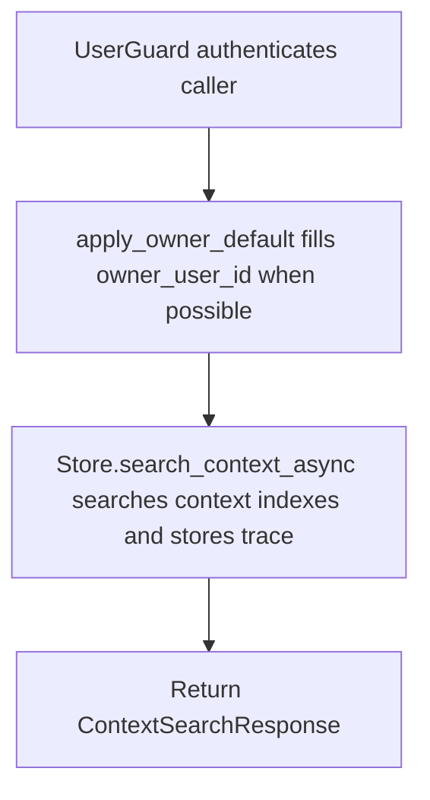

# POST /v1/context/search

## Summary
Search context nodes and create a trace for later reveal/debug operations.

## Handler
- Rust handler: `context_search`
- Route registration: `src/routes.rs::build_router`
- Authentication: UserGuard; owner default may apply

## Path Parameters
None.

## Query Parameters
None.

## JSON Body Parameters
Schema: `ContextSearchRequest`

| Field | Type | Requirement | Description |
| --- | --- | --- | --- |
| query | string | optional | Search query. |
| mode | string | optional, default auto | Search mode selector. |
| target_uri | string | optional | Target URI used by reveal-style searches. |
| filters | object | optional, default null | Structured filters passed to the context store. |
| owner_user_id | string | optional, auth default may apply | Owner scope. |
| limit | integer | optional, default 10 | Maximum context hits returned. |
| debug | boolean | optional, default false | Include stage details in the trace response. |

## Response
Schema: `ContextSearchResponse`

| Field | Type | Description |
| --- | --- | --- |
| trace_id | string | Trace id for reveal/debug. |
| hits | ContextHit[] | Matching context hits. |
| stages | object[] | Search stage details. |

## Errors and Access Rules
- Malformed JSON or missing required runtime fields returns 400.
- Owner-scoped endpoints return 403 when the authenticated principal cannot access the requested owner.
- Store, Meilisearch, or LLM failures are returned through the shared ApiError JSON envelope.

## Internal Logic Call Graph

