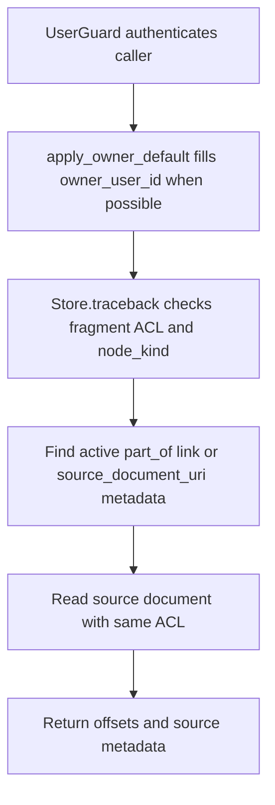

# POST /v1/context/traceback

## Summary
Trace a fragment context URI back to the full source document it was generated from.

Use this endpoint when retrieval returns a fragment and the caller needs source-document metadata before explicitly reading the full source document.

## Handler
- Rust handler: `context_traceback`
- Route registration: `src/routes.rs::build_router`
- Authentication: UserGuard; owner default may apply

## Path Parameters
None.

## Query Parameters
None.

## JSON Body Parameters
Schema: `ContextTracebackRequest`

| Field | Type | Requirement | Description |
| --- | --- | --- | --- |
| uri | string | required | Fragment context URI to trace. |
| owner_user_id | string | optional, auth default may apply | Owner scope for personal fragments. |

## Response
Schema: `ContextTracebackResponse`

| Field | Type | Description |
| --- | --- | --- |
| fragment_uri | string | Fragment URI that was traced. |
| fragment_title | string | Fragment title. |
| fragment_index | integer? | Zero-based fragment index. |
| checksum | string? | Stable fragment checksum. |
| token_estimate | integer? | Approximate fragment token count. |
| source_document_uri | string | Source document URI. |
| source_id | string | Source identifier. |
| revision_id | string | Source revision identifier. |
| char_start | integer? | Fragment start character offset in the source document. |
| char_end | integer? | Fragment end character offset in the source document. |
| source_title | string | Source document title. |

## Errors and Access Rules
- Malformed JSON or missing required runtime fields returns 400.
- Non-fragment URIs return 400.
- Owner-scoped endpoints return 403 when the authenticated principal cannot access the requested owner.
- Inaccessible or missing fragments/source documents return 404.
- Ordinary users can trace only fragments visible in their owner scope; admins can inspect company/global source documents.
- Store, Meilisearch, or LLM failures are returned through the shared ApiError JSON envelope.

## Internal Logic Call Graph

