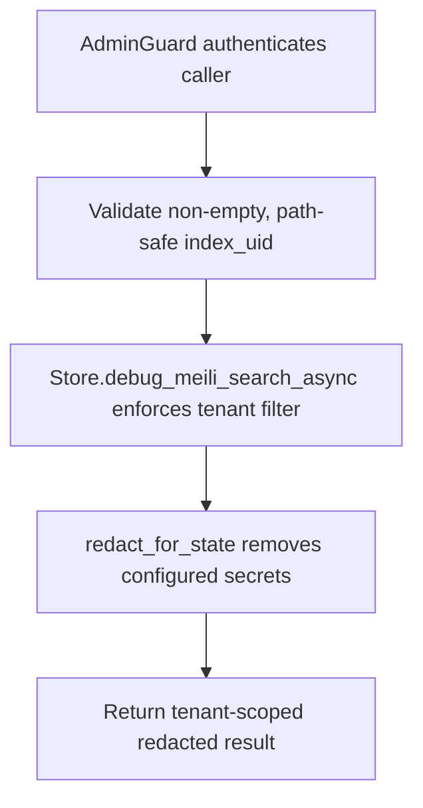

# POST /v1/debug/meili/search

## Summary
Run a tenant-scoped debug search against a Meilisearch index and redact configured secrets from the response.

This admin-only helper can inspect managed indexes directly, including `rag_source_documents`, but every query is constrained to the server's configured tenant. It bypasses normal default retrieval behavior and should not be treated as user-facing RAG search semantics. Global inspection is deliberately unavailable over HTTP; operators who require it must use separately controlled Meilisearch maintenance credentials.

## Handler
- Rust handler: `debug_meili_search`
- Route registration: `src/routes.rs::build_router`
- Authentication: AdminGuard

## Path Parameters
None.

## Query Parameters
None.

## JSON Body Parameters
Schema: `DebugMeiliSearchRequest`

| Field | Type | Requirement | Description |
| --- | --- | --- | --- |
| index_uid | string | required | Target Meilisearch index UID using only ASCII letters, digits, `-`, and `_`, such as `rag_company_context`, an owner personal context index, `rag_links`, or `rag_source_documents`. |
| query | string | optional, default empty string | Raw search query passed to the debug search helper. |

## Response
Schema: `JsonValue`

| Field | Type | Description |
| --- | --- | --- |
| ... | object or array | Tenant-scoped JSON returned by the store or debug helper, with internal storage IDs restored to public logical IDs. |

## Errors and Access Rules
- Malformed JSON or missing required runtime fields returns 400.
- Owner-scoped endpoints return 403 when the authenticated principal cannot access the requested owner.
- Admin authentication is required because index search can expose source document content within the configured tenant.
- Store, Meilisearch, or LLM failures are returned through the shared ApiError JSON envelope.
- index_uid body field is required.
- Invalid or path-like index UIDs return 400 before any Meilisearch request.

## Internal Logic Call Graph

