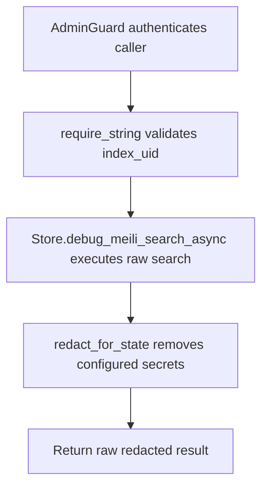

# POST /v1/debug/meili/search

## Summary
Run a raw debug search against a Meilisearch index and redact configured secrets from the response.

## Handler
- Rust handler: `debug_meili_search`
- Route registration: `src/routes.rs::build_router`
- Authentication: AdminGuard

## Path Parameters
None.

## Query Parameters
None.

## JSON Body Parameters
Schema: `DebugMeiliSearchRequest`

| Field | Type | Requirement | Description |
| --- | --- | --- | --- |
| index_uid | string | required | Target Meilisearch index UID. |
| query | string | optional, default empty string | Raw search query passed to the debug search helper. |

## Response
Schema: `JsonValue`

| Field | Type | Description |
| --- | --- | --- |
| ... | object or array | Endpoint-specific JSON returned by the store or debug helper. |

## Errors and Access Rules
- Malformed JSON or missing required runtime fields returns 400.
- Owner-scoped endpoints return 403 when the authenticated principal cannot access the requested owner.
- Store, Meilisearch, or LLM failures are returned through the shared ApiError JSON envelope.
- index_uid body field is required.

## Internal Logic Call Graph

