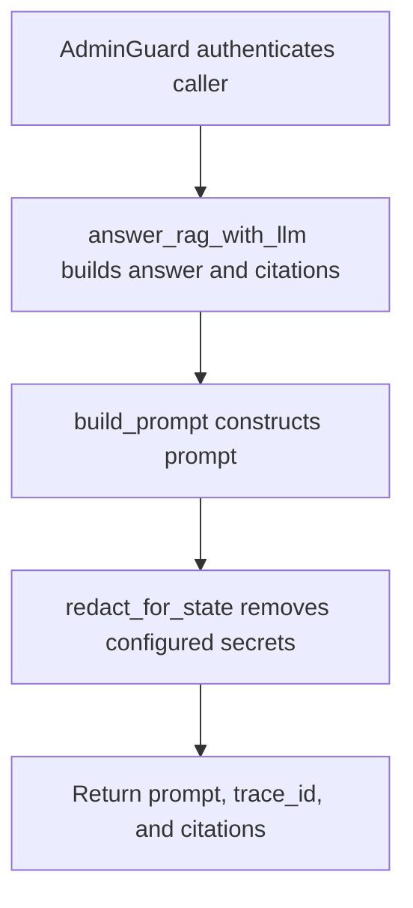

# POST /v1/debug/prompt/preview

## Summary
Build a RAG answer and return the redacted prompt preview, trace id, and citations.

## Handler
- Rust handler: `prompt_preview`
- Route registration: `src/routes.rs::build_router`
- Authentication: AdminGuard

## Path Parameters
None.

## Query Parameters
None.

## JSON Body Parameters
Schema: `RagAnswerRequest`

| Field | Type | Requirement | Description |
| --- | --- | --- | --- |
| question | string | optional | Question to answer. |
| mode | string | optional, default auto | Retrieval mode selector. |
| session_id | string | optional | Session to associate with the answer. |
| owner_user_id | string | optional, auth default may apply | Owner scope. |
| debug | boolean | optional, default false | Request debug data from retrieval. |

## Response
Schema: `JsonValue`

| Field | Type | Description |
| --- | --- | --- |
| ... | object or array | Endpoint-specific JSON returned by the store or debug helper. |

## Errors and Access Rules
- Malformed JSON or missing required runtime fields returns 400.
- Owner-scoped endpoints return 403 when the authenticated principal cannot access the requested owner.
- Store, Meilisearch, or LLM failures are returned through the shared ApiError JSON envelope.

## Internal Logic Call Graph

