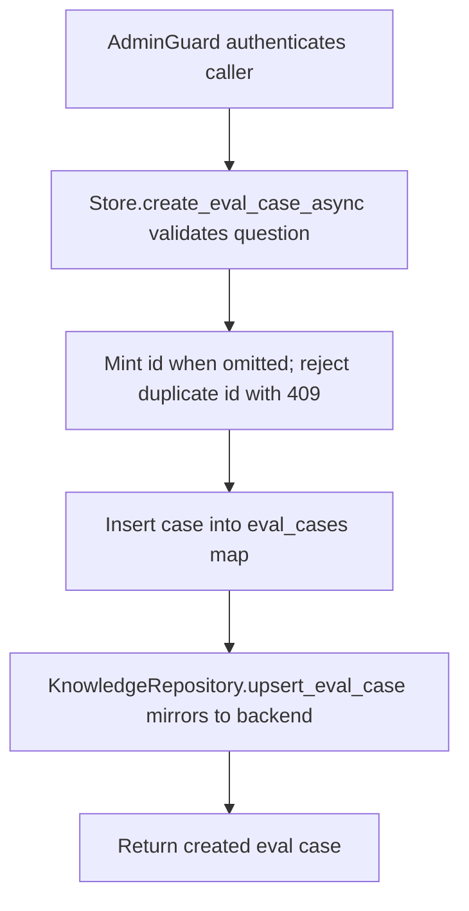

# POST /v1/eval/cases

## Summary
Create a RAG evaluation case describing a question and its expected retrieval and answer assertions. The case is persisted in the store and mirrored to the repository backend.

## Handler
- Rust handler: `create_eval_case`
- Route registration: `src/routes.rs::build_router`
- Authentication: AdminGuard

## Path Parameters
None.

## Query Parameters
None.

## JSON Body Parameters
Schema: `CreateRagEvalCaseRequest`

| Field | Type | Requirement | Description |
| --- | --- | --- | --- |
| id | string | optional | Explicit case identifier. Auto-minted with an `evalcase` prefix when omitted. |
| owner_user_id | string | optional | Owner scope applied to retrieval when the case runs. |
| question | string | required | Question replayed during a run. Rejected with 400 when missing or blank. |
| expected_context_uris | string[] | optional, default `[]` | ContextFS URIs expected in retrieval. |
| expected_source_document_uris | string[] | optional, default `[]` | Source document URIs expected in retrieval. |
| expected_answer_contains | string[] | optional, default `[]` | Substrings expected in the generated answer. |
| tags | string[] | optional, default `[]` | Free-form labels; at most `RAG_MAX_TAGS_PER_ITEM`, each at most `RAG_MAX_TAG_BYTES` UTF-8 bytes. |
| metadata | object | optional, default `null` | Arbitrary caller metadata stored verbatim. |

## Response
Schema: `RagEvalCase`

| Field | Type | Description |
| --- | --- | --- |
| id | string | Eval case identifier (`evalcase` prefix when auto-minted). |
| tenant_id | string | Tenant that owns the case. |
| owner_user_id | string or null | Owner scope applied to retrieval during a run; omitted when unset. |
| question | string | Stored question. |
| expected_context_uris | string[] | Expected ContextFS URIs. |
| expected_source_document_uris | string[] | Expected source document URIs. |
| expected_answer_contains | string[] | Expected answer substrings. |
| tags | string[] | Stored labels. |
| metadata | object | Stored caller metadata. |
| created_at | string | RFC3339 creation timestamp. |

## Errors and Access Rules
- Malformed JSON or missing required runtime fields returns 400.
- Excess tags return 400 `validation_error` with `details.field=tags`; an
  oversized tag uses `details.field=tags[i]` before persistence.
- Owner-scoped endpoints return 403 when the authenticated principal cannot access the requested owner.
- Store, Meilisearch, or LLM failures are returned through the shared ApiError JSON envelope.
- Requires admin authentication; non-admin principals are rejected by AdminGuard.
- A blank or missing `question` returns 400 (`question is required`).
- A supplied `id` that already exists returns 409 (`eval case already exists`).

## Internal Logic Call Graph

