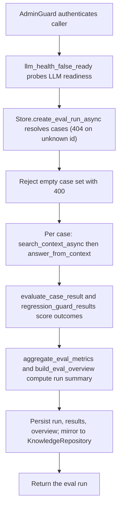

# POST /v1/eval/runs

## Summary
Execute an evaluation run across a set of eval cases. Each case is replayed through context search and answer synthesis, per-case results and regression guards are scored, aggregate metrics and an overview are computed, and the run plus its reports are persisted and mirrored to the repository backend.

## Handler
- Rust handler: `create_eval_run`
- Route registration: `src/routes.rs::build_router`
- Authentication: AdminGuard

## Path Parameters
None.

## Query Parameters
None.

## JSON Body Parameters
Schema: `CreateRagEvalRunRequest`

| Field | Type | Requirement | Description |
| --- | --- | --- | --- |
| case_ids | string[] | optional, default `[]` | Cases to run. When empty, every stored eval case is included. |
| change_id | string | optional | Change identifier associated with the run for delta reporting. |
| created_by | string | optional, default `admin` | Attribution recorded on the run. |

## Response
Schema: `RagEvalRun`

| Field | Type | Description |
| --- | --- | --- |
| id | string | Run identifier (`evalrun` prefix). |
| tenant_id | string | Tenant that owns the run. |
| change_id | string or null | Associated change identifier; omitted when unset. |
| case_ids | string[] | Case identifiers included in the run. |
| result_ids | string[] | Identifiers of the per-case result records produced. |
| trace_ids | string[] | Retrieval trace identifiers, one per case. |
| status | string | `passed` when all cases and guards pass, otherwise `failed`. |
| metrics | object | Aggregate `RagEvalMetrics` for the run. |
| metrics.pass_rate | number | Fraction of cases that passed. |
| metrics.retrieval_recall_at_5 | number | Recall of expected URIs within the top 5 retrieved. |
| metrics.citation_precision | number | Precision of citations against expected sources. |
| metrics.traceback_success_rate | number | Fraction of cases with successful provenance traceback. |
| metrics.source_doc_leak_rate | number | Fraction of cases leaking raw source documents. |
| metrics.acl_violation_rate | number | Fraction of cases with owner/ACL violations. |
| metrics.stale_fragment_rate | number | Fraction of cases returning stale fragments. |
| metrics.state_history_consistency_rate | number | 1.0 when state/history consistency guards pass, else 0.0. |
| metrics.llm_health_false_ready_rate | number | 1.0 when the LLM reported ready but was not, else 0.0. |
| metrics.tokens_per_answer | number | Mean tokens per generated answer. |
| metrics.latency_p95 | number | 95th-percentile per-case latency in milliseconds. |
| guard_results | object[] | Regression guard outcomes (`RegressionGuardResult`). |
| guard_results[].name | string | Guard identifier. |
| guard_results[].passed | boolean | Whether the guard passed. |
| guard_results[].evidence | object | Guard-specific evidence payload. |
| overview_source_document_uri | string or null | ContextFS URI of the persisted overview document; omitted when unset. |
| report_source_document_uris | string[] | ContextFS URIs of persisted per-case report documents. |
| created_by | string | Attribution recorded on the run. |
| created_at | string | RFC3339 creation timestamp. |
| completed_at | string or null | RFC3339 completion timestamp; omitted when unset. |

## Errors and Access Rules
- Malformed JSON or missing required runtime fields returns 400.
- Owner-scoped endpoints return 403 when the authenticated principal cannot access the requested owner.
- Store, Meilisearch, or LLM failures are returned through the shared ApiError JSON envelope.
- Requires admin authentication; non-admin principals are rejected by AdminGuard.
- An unknown entry in `case_ids` returns 404 (`eval case not found`).
- A resolved case set that is empty (no stored cases when `case_ids` is omitted) returns 400 (`at least one eval case is required`).

## Internal Logic Call Graph

