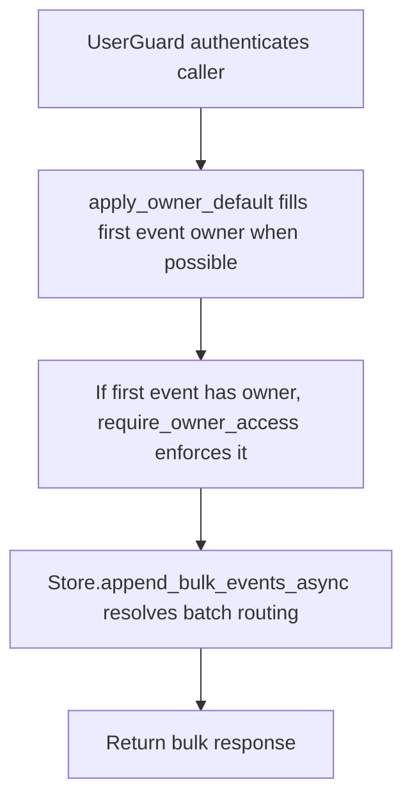

# POST /v1/history/events:bulk

## Summary
Owner-aware alias for appending multiple history events without owner in the path.

## Handler
- Rust handler: `append_events_bulk_alias`
- Route registration: `src/routes.rs::build_router`
- Authentication: UserGuard; first event owner is enforced

## Path Parameters
None.

## Query Parameters
None.

## JSON Body Parameters
Schema: `BulkHistoryEventsRequest`

| Field | Type | Requirement | Description |
| --- | --- | --- | --- |
| events | AppendHistoryEventRequest[] | optional, default [] | Events to insert in one owner/index routing operation; at most `RAG_MAX_BULK_EVENTS`. Every event's tags use the configured tag count/byte bounds. |
| idempotency_key | string | optional | Batch-level idempotency key. |

## Response
Schema: `BulkHistoryEventsResponse`

| Field | Type | Description |
| --- | --- | --- |
| inserted | integer | Number of events inserted. |
| duplicates | integer | Number of duplicate events skipped. |
| event_ids | string[] | Event ids affected by the batch. |
| materialization_job_ids | string[] | Context materialization job ids. |
| routing | EventIndexRouting | Owner index routing used for the batch. |
| meili_task_uid | string? | Meilisearch indexing task id when available. |

## Errors and Access Rules
- Malformed JSON or missing required runtime fields returns 400.
- More than `RAG_MAX_BULK_EVENTS` returns 400 `validation_error` with
  `details.field=events`. Nested tag failures identify
  `events[i].tags` or `events[i].tags[j]`. The alias and path-scoped route use
  the same pre-mutation validation.
- Owner-scoped endpoints return 403 when the authenticated principal cannot access the requested owner.
- Store, Meilisearch, or LLM failures are returned through the shared ApiError JSON envelope.

## Internal Logic Call Graph

