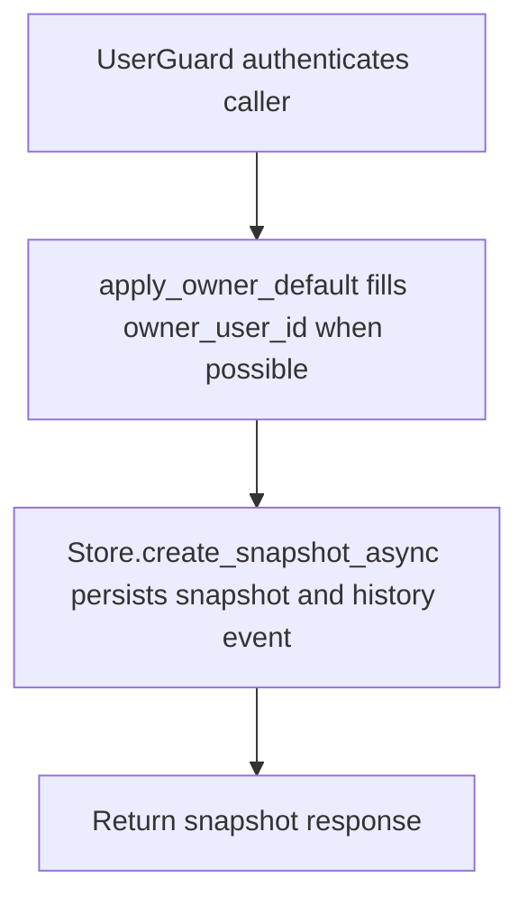

# POST /v1/history/structured/snapshots

## Summary
Create a structured data snapshot for a dataset and owner.

## Handler
- Rust handler: `create_snapshot`
- Route registration: `src/routes.rs::build_router`
- Authentication: UserGuard; owner default may apply

## Path Parameters
None.

## Query Parameters
None.

## JSON Body Parameters
Schema: `CreateStructuredSnapshotRequest`

| Field | Type | Requirement | Description |
| --- | --- | --- | --- |
| dataset_key | string | optional | Dataset key for the snapshot. |
| owner_user_id | string | optional, auth default may apply | Owner for the snapshot. |
| period_key | string | optional | Period identifier such as 2026-W20. |
| period_start | RFC3339 datetime | optional | Period start. |
| period_end | RFC3339 datetime | optional | Period end. |
| granularity | string | optional | Period granularity. |
| checksum | string | optional | Snapshot checksum. |
| source_ref | SourceRef object | optional | Source reference for the snapshot. |
| idempotency_key | string | optional | Client deduplication key. |

## Response
Schema: `StructuredSnapshotResponse`

| Field | Type | Description |
| --- | --- | --- |
| snapshot | StructuredSnapshot | Created snapshot metadata. |
| history_event_id | string | History event emitted for the snapshot. |

## Errors and Access Rules
- Malformed JSON or missing required runtime fields returns 400.
- Owner-scoped endpoints return 403 when the authenticated principal cannot access the requested owner.
- Store, Meilisearch, or LLM failures are returned through the shared ApiError JSON envelope.

## Internal Logic Call Graph

