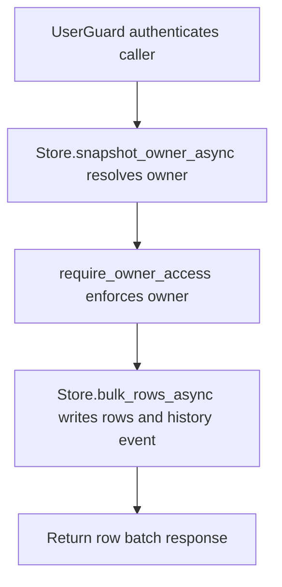

# POST /v1/history/structured/snapshots/{snapshot_id}/rows:bulk

## Summary
Insert or deduplicate rows for a structured snapshot.

## Handler
- Rust handler: `bulk_rows`
- Route registration: `src/routes.rs::build_router`
- Authentication: UserGuard; snapshot owner enforced

## Path Parameters
| Name | Type | Description |
| --- | --- | --- |
| snapshot_id | string | Structured snapshot identifier. |

## Query Parameters
None.

## JSON Body Parameters
Schema: `BulkStructuredRowsRequest`

| Field | Type | Requirement | Description |
| --- | --- | --- | --- |
| rows | object[] | optional, default [] | Rows to attach to the snapshot. |
| mode | string | optional, default insert | Write mode for row ingestion. |
| idempotency_key | string | optional | Client deduplication key. |

## Response
Schema: `BulkStructuredRowsResponse`

| Field | Type | Description |
| --- | --- | --- |
| snapshot_id | string | Snapshot id. |
| inserted | integer | Rows inserted. |
| duplicates | integer | Rows skipped as duplicates. |
| invalid | integer | Rows rejected as invalid. |
| row_ids | string[] | Affected row ids. |
| history_event_id | string | History event emitted for the row batch. |

## Errors and Access Rules
- Malformed JSON or missing required runtime fields returns 400.
- Owner-scoped endpoints return 403 when the authenticated principal cannot access the requested owner.
- Store, Meilisearch, or LLM failures are returned through the shared ApiError JSON envelope.

## Internal Logic Call Graph

