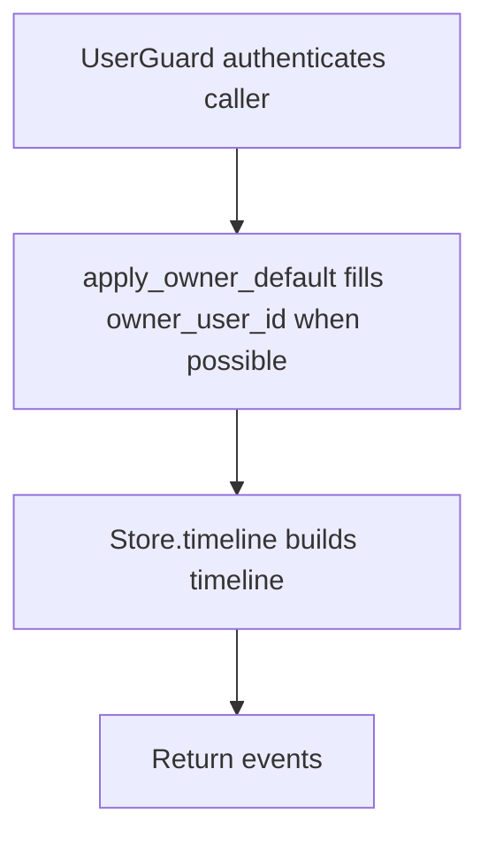

# POST /v1/history/timeline

## Summary
Owner-aware alias for building a timeline without owner in the path.

## Handler
- Rust handler: `timeline_alias`
- Route registration: `src/routes.rs::build_router`
- Authentication: UserGuard; body owner or owner-bound auth required

## Path Parameters
None.

## Query Parameters
None.

## JSON Body Parameters
Schema: `TimelineQueryRequest`

| Field | Type | Requirement | Description |
| --- | --- | --- | --- |
| owner_user_id | string | optional or path-derived | Owner scope for alias endpoints; path-scoped routes pass the path owner. |
| entity_refs | object[] | optional, default [] | Entity references used to narrow timeline assembly. |
| from | RFC3339 datetime | optional | Lower timeline bound. |
| to | RFC3339 datetime | optional | Upper timeline bound. |
| include_state_changes | boolean | optional, default false | Include state change events when supported by the store. |
| include_doc_revisions | boolean | optional, default false | Include company document revision events when supported by the store. |
| limit | integer | optional, default 10 | Maximum events returned. |

## Response
Schema: `TimelineResponse`

| Field | Type | Description |
| --- | --- | --- |
| events | HistoryEvent[] | Timeline events in store-defined order. |

## Errors and Access Rules
- Malformed JSON or missing required runtime fields returns 400.
- Owner-scoped endpoints return 403 when the authenticated principal cannot access the requested owner.
- Store, Meilisearch, or LLM failures are returned through the shared ApiError JSON envelope.

## Internal Logic Call Graph

