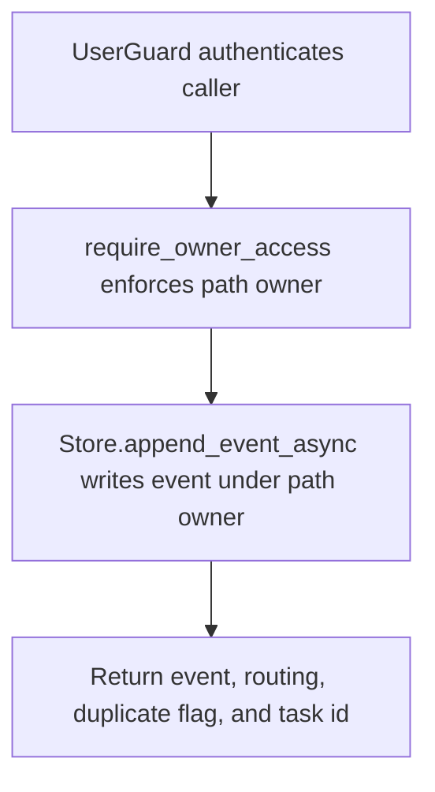

# POST /v1/history/users/{owner_user_id}/events

## Summary
Append one history event to a specific owner history index.

## Handler
- Rust handler: `append_user_event`
- Route registration: `src/routes.rs::build_router`
- Authentication: UserGuard; path owner enforced

## Path Parameters
| Name | Type | Description |
| --- | --- | --- |
| owner_user_id | string | Owner user id whose private history index is targeted. |

## Query Parameters
None.

## JSON Body Parameters
Schema: `AppendHistoryEventRequest`

| Field | Type | Requirement | Description |
| --- | --- | --- | --- |
| event_type | string | optional | Application event type. Store defaults are used when omitted. |
| entity_type | string | optional | Logical entity type associated with the event. |
| entity_id | string | optional | Logical entity identifier associated with the event. |
| owner_user_id | string | optional or path-derived | Owner for alias endpoints. User-scoped routes use the path owner and enforce access. |
| occurred_at | RFC3339 datetime | optional | When the event happened. |
| observed_at | RFC3339 datetime | optional | When the system observed the event. |
| source_kind | string | optional | Source system or ingestion kind. |
| source_ref | SourceRef object | optional | Source reference with kind, id, optional uri, and optional meta. |
| text | string | optional | Searchable human-readable event text. |
| payload | object | optional, default {} | Structured event payload stored with the event. |
| tags | string[] | optional, default [] | Search and grouping tags; at most `RAG_MAX_TAGS_PER_ITEM`, each at most `RAG_MAX_TAG_BYTES` UTF-8 bytes. |
| privacy | string | optional, default private | Privacy label for the event. |
| promote_policy | string | optional, default none | Policy hint for promoting the event into state or context. |
| idempotency_key | string | optional | Client key used to deduplicate writes for the owner. |
| event_index_hint | object | optional | Caller hint about the expected event index routing. |

## Response
Schema: `HistoryEventResponse`

| Field | Type | Description |
| --- | --- | --- |
| event | HistoryEvent | Inserted or deduplicated event. |
| duplicate | boolean | True when idempotency matched an existing event. |
| materialization_job_id | string? | Context materialization job id when created. |
| routing | EventIndexRouting | Owner index routing used for the write. |
| meili_task_uid | string? | Meilisearch indexing task id when available. |

## Errors and Access Rules
- Malformed JSON or missing required runtime fields returns 400.
- Excess tags return 400 `validation_error` with `details.field=tags`; an
  oversized tag uses `details.field=tags[i]`. Validation happens before store
  mutation.
- Owner-scoped endpoints return 403 when the authenticated principal cannot access the requested owner.
- Store, Meilisearch, or LLM failures are returned through the shared ApiError JSON envelope.

## Internal Logic Call Graph

