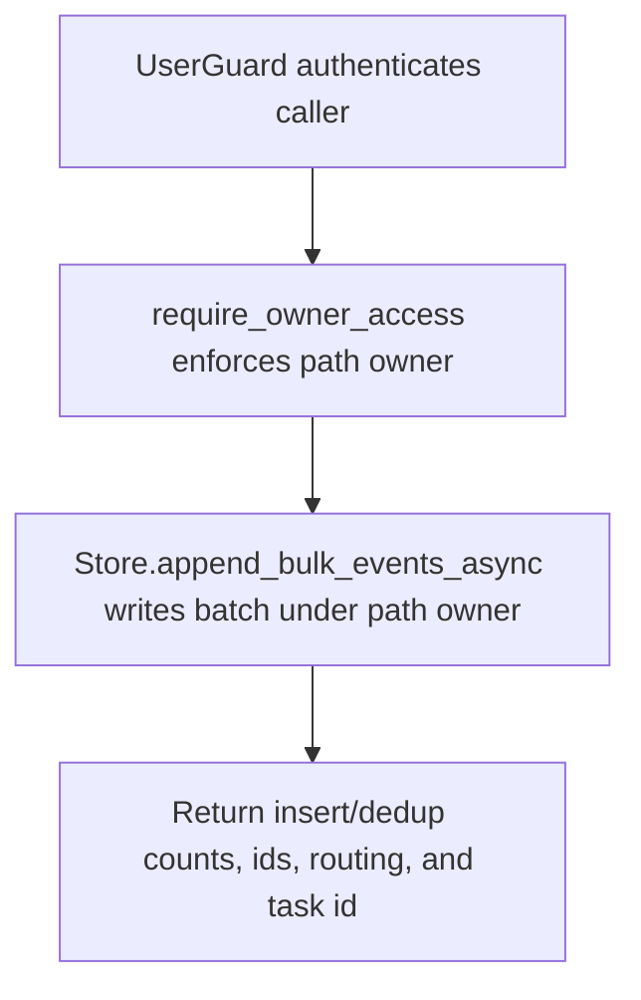

# POST /v1/history/users/{owner_user_id}/events:bulk

## Summary
Append multiple history events to a specific owner history index.

## Handler
- Rust handler: `append_user_events_bulk`
- Route registration: `src/routes.rs::build_router`
- Authentication: UserGuard; path owner enforced

## Path Parameters
| Name | Type | Description |
| --- | --- | --- |
| owner_user_id | string | Owner user id whose private history index is targeted. |

## Query Parameters
None.

## JSON Body Parameters
Schema: `BulkHistoryEventsRequest`

| Field | Type | Requirement | Description |
| --- | --- | --- | --- |
| events | AppendHistoryEventRequest[] | optional, default [] | Events to insert in one owner/index routing operation; at most `RAG_MAX_BULK_EVENTS`. Every event's tags use the configured tag count/byte bounds. Nested event idempotency keys are not supported. |
| idempotency_key | string | optional | Batch-level key bound to the path owner and full canonical batch; reuse with a different batch returns 409. |

## Response
Schema: `BulkHistoryEventsResponse`

| Field | Type | Description |
| --- | --- | --- |
| inserted | integer | Number of events inserted. |
| duplicates | integer | Number of duplicate events skipped. |
| event_ids | string[] | Event ids affected by the batch. |
| materialization_job_ids | string[] | Context materialization job ids. |
| routing | EventIndexRouting | Owner index routing used for the batch. |
| meili_task_uid | string? | Last primary event-batch Meilisearch task id when available. |
| persistence | PersistenceMetadata? | Durable operation id, status, indexing state, ordered primary task ids, and all task ids. |

The bounded batch is prevalidated and submitted as one primary operation. If
that primary is committed but a derived context write fails, the response
returns every stable event id with `persistence.status=partially_failed`.
Retrying the same path owner and batch `idempotency_key` reconciles unfinished
steps and replays the original counts and ids with the same operation id.

## Errors and Access Rules
- Malformed JSON or missing required runtime fields returns 400.
- `events[].idempotency_key` returns 400; use only the top-level batch key.
- More than `RAG_MAX_BULK_EVENTS` returns 400 `validation_error` with
  `details.field=events`. Nested tag failures identify
  `events[i].tags` or `events[i].tags[j]`. Validation happens before mutation.
- Owner-scoped endpoints return 403 when the authenticated principal cannot access the requested owner.
- Store, Meilisearch, or LLM failures are returned through the shared ApiError JSON envelope.

## Internal Logic Call Graph

