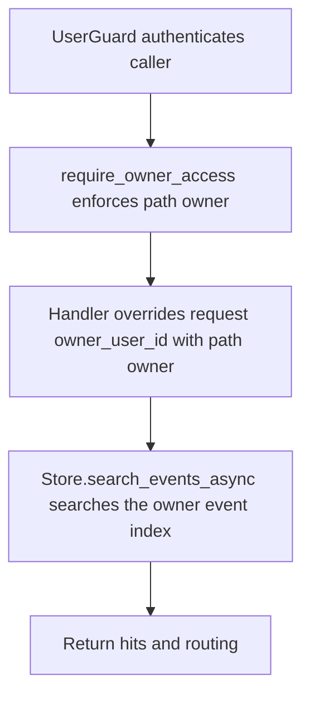

# POST /v1/history/users/{owner_user_id}/search

## Summary
Search history events in a specific owner event index.

## Handler
- Rust handler: `search_user_events`
- Route registration: `src/routes.rs::build_router`
- Authentication: UserGuard; path owner enforced

## Path Parameters
| Name | Type | Description |
| --- | --- | --- |
| owner_user_id | string | Owner user id whose private history index is targeted. |

## Query Parameters
None.

## JSON Body Parameters
Schema: `HistorySearchRequest`

| Field | Type | Requirement | Description |
| --- | --- | --- | --- |
| query | string | optional | Full-text query used for event search. |
| event_types | string[] | optional, default [] | Restrict results to these event types. |
| entity_type | string | optional | Restrict results to one entity type. |
| entity_id | string | optional | Restrict results to one entity id. |
| owner_user_id | string | optional or path-derived | Owner scope for alias endpoints; path-scoped routes override it. |
| from | RFC3339 datetime | optional | Lower occurred_at bound. |
| to | RFC3339 datetime | optional | Upper occurred_at bound. |
| limit | integer | optional, default 10 | Maximum number of events returned; must not exceed `RAG_MAX_SEARCH_LIMIT`. |

## Response
Schema: `HistorySearchResponse`

| Field | Type | Description |
| --- | --- | --- |
| hits | HistoryEvent[] | Matching history events. |
| routing | EventIndexRouting | Owner index routing searched. |

## Errors and Access Rules
- Malformed JSON or missing required runtime fields returns 400.
- `limit` above `RAG_MAX_SEARCH_LIMIT` returns 400 `validation_error` with
  `details.field=limit` before search.
- Owner-scoped endpoints return 403 when the authenticated principal cannot access the requested owner.
- Store, Meilisearch, or LLM failures are returned through the shared ApiError JSON envelope.

## Internal Logic Call Graph

