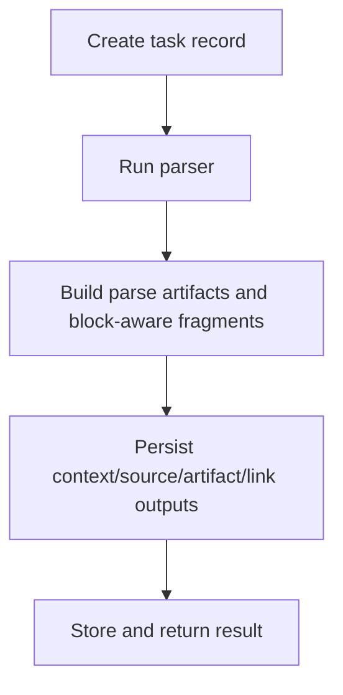

# POST /v1/ingest/files:sync

Synchronously ingest JSON text or supplied parser output and return the completed `IngestTaskResult`.

## Request

JSON `IngestTaskRequest`.

## Response

`IngestTaskResult` with a completed task, source document URI, parse artifacts, parsed blocks, fragment URIs, and context URIs.

Configured secrets are masked with equal character counts before retrieval
fragmentation, preserving offsets. Canonical source and parsed-block records may
retain original content internally, but the final JSON boundary redacts them
from this response. Codex tokens observed during the process lifetime remain in
the redaction inventory; operators must carry revoked values across restarts in
`RAG_REDACTION_PREVIOUS_SECRETS` until persisted records are reingested or
scrubbed.

## Rules

- Kept for tests and caller flows that need immediate completion.
- Uses the same parser, fragmenter, source-document, ACL, and retrieval safety rules as asynchronous ingest.

