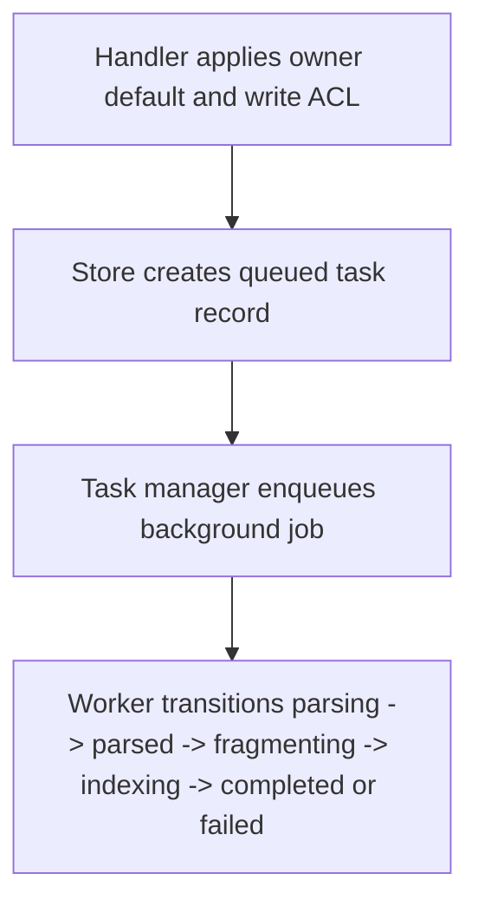

# POST /v1/ingest/tasks

Create an asynchronous ingest task. The handler creates an `IngestTask` in `queued` state and returns immediately; a background worker performs parsing, fragmenting, indexing, and result materialization.

## Request

JSON `IngestTaskRequest`.

| Field | Type | Notes |
| --- | --- | --- |
| owner_user_id | string? | Defaults to the authenticated owner. Required for owner-bound writes unless admin. |
| source_id / revision_id / title / source_uri | string? | Optional source metadata. Missing ids are generated. |
| content | string? | Text input for builtin or MinerU fallback. |
| content_list / content_list_v2 | object/array? | Supplied parser output; bypasses live parsing. |
| parser_provider | string? | `builtin` or `mineru`. |
| fragment_policy | object? | Chunk sizing overrides. |

## Response

`IngestTask` with `state=queued`, `status_url`, `result_url`, and `queued_ahead`.

## Rules

- The task is owner-scoped; other owners cannot read it.
- Source documents remain non-retrieval; generated active fragments are the only default retrieval records.

