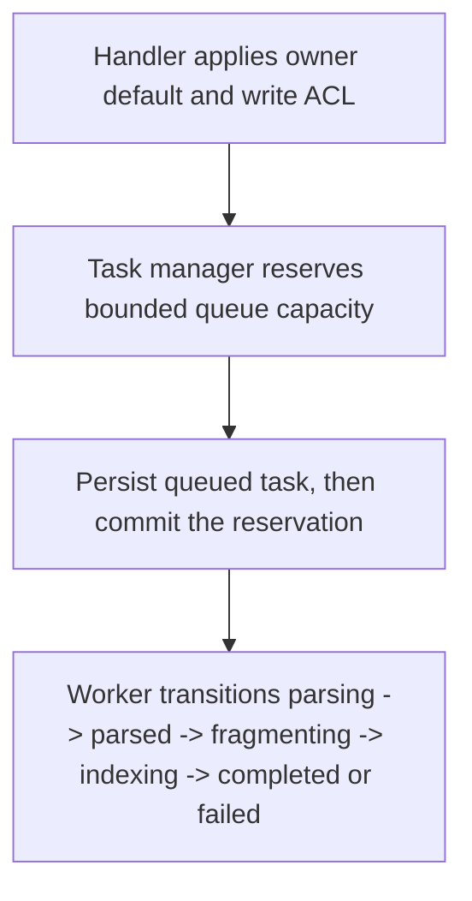

# POST /v1/ingest/tasks

Create an asynchronous ingest task. The handler creates an `IngestTask` in `queued` state and returns immediately; a background worker performs parsing, fragmenting, indexing, and result materialization.

## Request

JSON `IngestTaskRequest`.

| Field | Type | Notes |
| --- | --- | --- |
| owner_user_id | string? | Defaults to the authenticated owner. Required for owner-bound writes unless admin. |
| source_id / revision_id / title / source_uri | string? | Optional source metadata. Missing ids are generated. |
| content | string? | Text input for builtin or MinerU fallback. |
| content_list / content_list_v2 | object/array? | Supplied parser output; bypasses live parsing. |
| parser_provider | string? | `builtin` or `mineru`. |
| fragment_policy | object? | Chunk sizing overrides. |

## Response

`IngestTask` with `state=queued`, `status_url`, `result_url`, and `queued_ahead`.

## Rules

- The task is owner-scoped; other owners cannot read it.
- The JSON body is capped by `RAG_MAX_JSON_BYTES`; an oversized body returns
  413 `payload_too_large` before task creation.
- Asynchronous creation is rejected with 503 when workers are disabled or the
  service is closing, before any task record is stored. Global in-flight
  pressure uses the same `service_unavailable` envelope.
- Queue capacity is bounded by `RAG_INGEST_QUEUE_CAPACITY`. A full queue returns
  429 plus `Retry-After` immediately and does not create a task record.
- Authenticated principal pressure also returns 429. `RAG_REQUEST_TIMEOUT_MS`
  bounds request parsing and queue admission; a 504 timeout cannot enqueue a
  job after the response.
- On coordinated shutdown or startup recovery, unfinished task records become
  `failed` with `error=ingest_interrupted`.
- All responses include `X-Request-Id`; 429/503 pressure responses include
  `Retry-After`. See the [shared HTTP boundary contract](../README.md#http-boundary-contract).
- Source documents remain non-retrieval; generated active fragments are the only default retrieval records.

