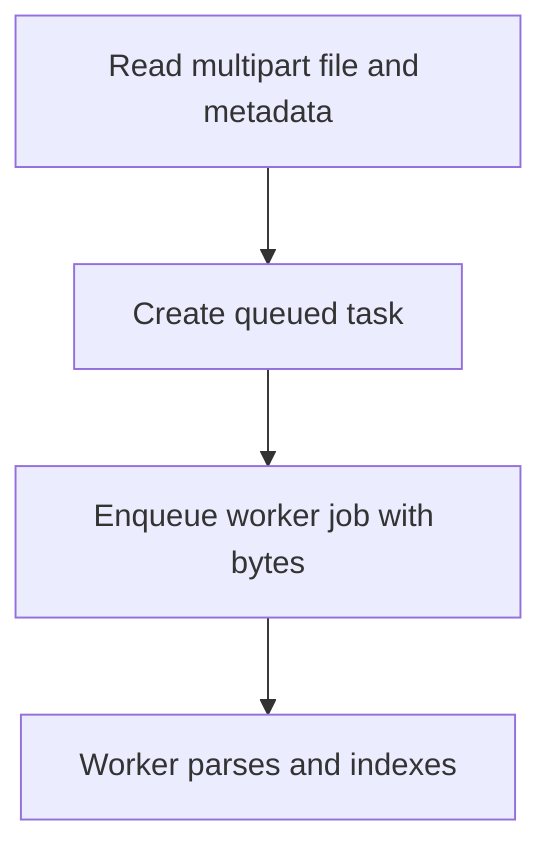

# POST /v1/ingest/uploads

Create an asynchronous ingest task from a multipart file upload.

## Multipart Fields

| Field | Notes |
| --- | --- |
| file | Required binary file part. |
| owner_user_id, source_id, revision_id, title, source_uri | Optional source metadata. |
| parser_provider | `builtin` for UTF-8 text or `mineru` for document/image bytes. |
| parser_backend | MinerU backend override. |
| fragment_policy.chunk_size_chars / overlap_chars / min_chunk_chars | Optional numeric fragment policy fields. |

## Response

Queued `IngestTask`.

## Rules

- Builtin parser accepts UTF-8 text uploads only.
- MinerU parser sends file bytes as multipart `files` to `/file_parse`.

