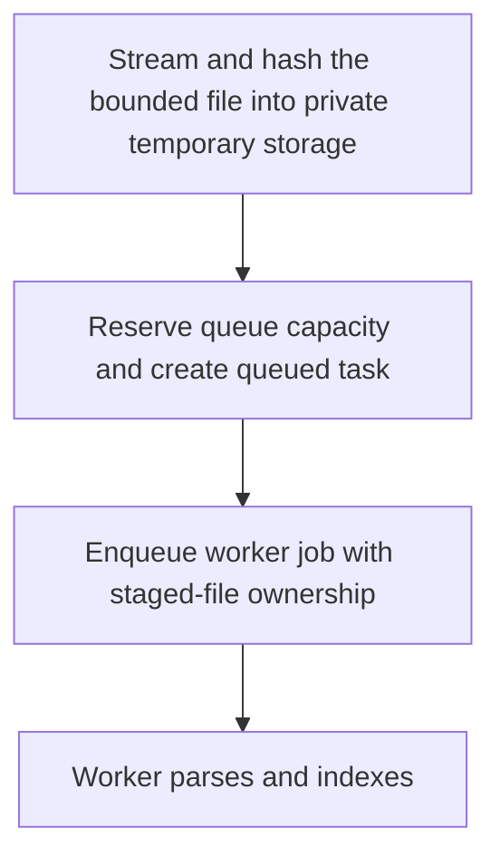

# POST /v1/ingest/uploads

Create an asynchronous ingest task from a multipart file upload.

## Multipart Fields

| Field | Notes |
| --- | --- |
| file / document / upload | Binary file part; at most one of these aliases is accepted. The part must include `Content-Type`. |
| owner_user_id, source_id, revision_id, title, source_uri | Optional source metadata. |
| parser_provider | `builtin` for UTF-8 text or `mineru` for document/image bytes. |
| parser_backend | MinerU backend override. |
| content_type | Optional MIME metadata. When present with a file, it must match the file part `Content-Type`. |
| checksum | Optional SHA-256 checksum as exactly 64 hexadecimal characters; malformed values or mismatches reject the request before task creation. |
| fragment_policy.chunk_size_chars / overlap_chars / min_chunk_chars | Optional numeric fragment policy fields. |

## Response

Queued `IngestTask`.

## Rules

- Builtin parser accepts UTF-8 text uploads only.
- File bytes are streamed to a private generated temporary file and rejected
  with 413 when they exceed `RAG_MAX_UPLOAD_BYTES`. Metadata and total field
  counts are bounded by `RAG_MAX_JSON_BYTES` and `RAG_MAX_MULTIPART_FIELDS`.
- At most one file part is accepted, and it must be nonempty. The server
  sanitizes the client filename, requires a valid part `Content-Type`, computes
  SHA-256 incrementally, and removes partial or completed staging files after
  cancellation, failure, or parsing.
- The effective MIME type must be in `RAG_UPLOAD_ALLOWED_MIME_TYPES`. The
  default is `text/plain`, `text/markdown`, `application/octet-stream`, PDF,
  OOXML Word/PowerPoint/Excel, PNG, JPEG, WebP, GIF, and TIFF. A valid but
  unconfigured MIME type returns 400 `validation_error` with
  `details.field=content_type`.
- A file cannot be combined with `content`, `content_list`, `content_list_v2`,
  `middle_json`, or `model_json`; that shape returns 400
  with `details.field=multipart`.
- MinerU receives the staged file as a streaming multipart `files` part; the
  upload is not duplicated into an in-memory byte buffer.
- Disabled/closing workers return 503; a full queue returns 429. Both pressure
  responses include `Retry-After` and create no task record.
- `RAG_REQUEST_TIMEOUT_MS` bounds upload parsing and queue admission. Timeout
  returns 504 and cannot leave a queued task or staged temporary file behind.
- All responses include `X-Request-Id`; see the
  [shared HTTP boundary contract](../README.md#http-boundary-contract).

