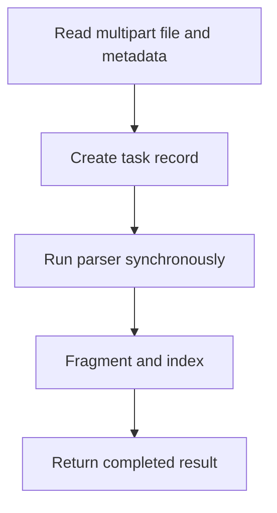

# POST /v1/ingest/uploads:sync

Synchronously ingest a multipart file upload and return the completed `IngestTaskResult`.

## Multipart Fields

Same fields as `POST /v1/ingest/uploads`.

## Response

Completed `IngestTaskResult`.

## Rules

- Text files can use `parser_provider=builtin`.
- PDF/DOCX/PPTX/XLSX/image bytes should use `parser_provider=mineru`.
- Invalid MIME strings are rejected before parser dispatch.

