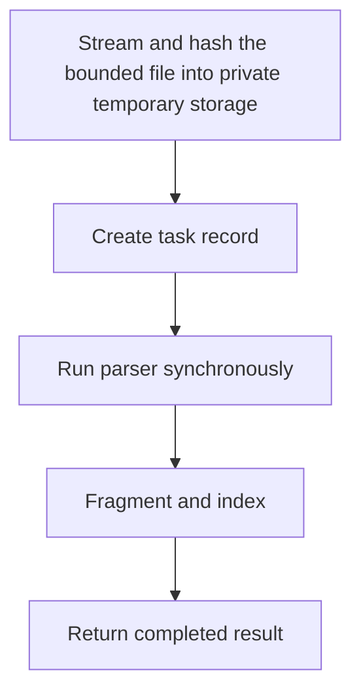

# POST /v1/ingest/uploads:sync

Synchronously ingest a multipart file upload and return the completed `IngestTaskResult`.

## Handler

- Rust handler: `ingest_upload_sync`
- Route registration: `src/routes.rs::build_router`
- Authentication: UserGuard; owner write scope required

## Multipart Fields

Same fields as `POST /v1/ingest/uploads`.

## Response

Completed `IngestTaskResult`.

## Rules

- Text files can use `parser_provider=builtin`.
- `idempotency_key` is rejected with 400 and is never silently ignored.
- PDF/DOCX/PPTX/XLSX/image bytes should use `parser_provider=mineru`.
- The same streamed temporary-file, upload/field limits, duplicate-file,
  filename, MIME, exact 64-hex SHA-256 checksum, and cleanup rules as the
  asynchronous upload apply.
- The file part `Content-Type` is required and must be in
  `RAG_UPLOAD_ALLOWED_MIME_TYPES`; the default includes
  `application/octet-stream`. Optional `content_type` metadata must match the
  part header, and a file cannot be combined with alternate content/parser
  output fields.
- `RAG_SYNC_INGEST_TIMEOUT_MS` bounds this route. Timeout returns 504 through
  the standard error envelope and marks the created task `ingest_interrupted`.
- A separate sync-ingest lane permits at most
  `RAG_INGEST_MAX_CONCURRENT_TASKS` concurrent sync requests. Saturation
  returns 503 plus `Retry-After` before the multipart body is buffered or
  staged.
- Upload/body overflow returns 413; principal/global pressure returns 429/503.
  Pressure responses include `Retry-After`, and all responses include
  `X-Request-Id`. See the
  [shared HTTP boundary contract](../README.md#http-boundary-contract).

