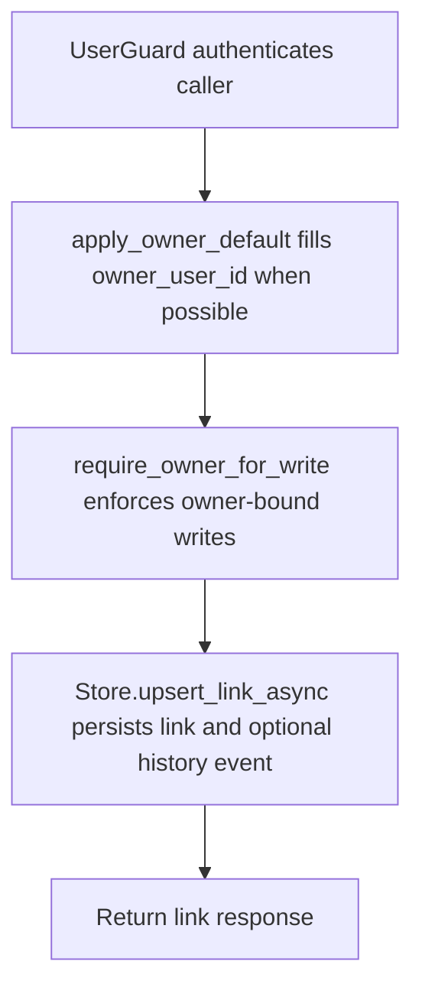

# POST /v1/links

## Summary
Create or merge a knowledge link between two context URIs.

## Handler
- Rust handler: `upsert_link`
- Route registration: `src/routes.rs::build_router`
- Authentication: UserGuard; writes require an owner scope for non-admin callers

## Path Parameters
None.

## Query Parameters
None.

## JSON Body Parameters
Schema: `LinkUpsertRequest`

| Field | Type | Requirement | Description |
| --- | --- | --- | --- |
| owner_user_id | string | optional, auth default may apply | Owner for the link. Writes require an owner for non-admin callers. |
| source_uri | string | optional | Source context URI. |
| target_uri | string | optional | Target context URI. |
| source_title | string | optional | Display title for the source URI. |
| target_title | string | optional | Display title for the target URI. |
| relation | string | optional, default related | Relationship type. |
| rationale | string | optional | Reason the link exists. |
| evidence_text | string | optional | Evidence recorded for the link. |
| confidence | number | optional, default 0.7 | Confidence score. |
| created_by | string | optional, default api | Producer label. |
| tags | string[] | optional, default [] | Tags for search and filtering. |
| idempotency_key | string | optional | Client deduplication key. |

## Response
Schema: `LinkResponse`

| Field | Type | Description |
| --- | --- | --- |
| link | KnowledgeLink | Stored link. |
| decision | string | Store merge/upsert decision. |
| history_event_id | string? | History event id when emitted. |

## Errors and Access Rules
- Malformed JSON or missing required runtime fields returns 400.
- Owner-scoped endpoints return 403 when the authenticated principal cannot access the requested owner.
- Store, Meilisearch, or LLM failures are returned through the shared ApiError JSON envelope.

## Internal Logic Call Graph

