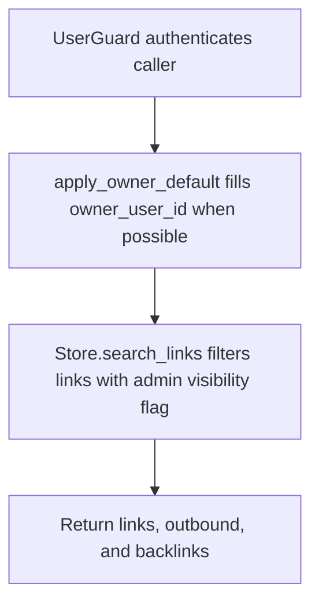

# POST /v1/links/search

## Summary
Search knowledge links by query, URI, direction, relationship type, status, and owner.

## Handler
- Rust handler: `search_links`
- Route registration: `src/routes.rs::build_router`
- Authentication: UserGuard; owner default may apply

## Path Parameters
None.

## Query Parameters
None.

## JSON Body Parameters
Schema: `LinkSearchRequest`

| Field | Type | Requirement | Description |
| --- | --- | --- | --- |
| owner_user_id | string | optional, auth default may apply | Owner scope. |
| query | string | optional | Full-text query. |
| uri | string | optional | Context URI used for inbound/outbound lookup. |
| direction | string | optional, default both | Link direction: both, outbound, or backlinks. |
| relations | string[] | optional, default [] | Relationship type filter. |
| status | string | optional, default active | Link status filter. |
| limit | integer | optional, default 10 | Maximum links returned; must not exceed `RAG_MAX_SEARCH_LIMIT`. |

## Response
Schema: `LinkSearchResponse`

| Field | Type | Description |
| --- | --- | --- |
| links | KnowledgeLink[] | All matching links. |
| outbound | KnowledgeLink[] | Outbound links from uri when requested. |
| backlinks | KnowledgeLink[] | Inbound links to uri when requested. |

## Errors and Access Rules
- Malformed JSON or missing required runtime fields returns 400.
- `limit` above `RAG_MAX_SEARCH_LIMIT` returns 400 `validation_error` with
  `details.field=limit` before search.
- Owner-scoped endpoints return 403 when the authenticated principal cannot access the requested owner.
- Store, Meilisearch, or LLM failures are returned through the shared ApiError JSON envelope.

## Internal Logic Call Graph

