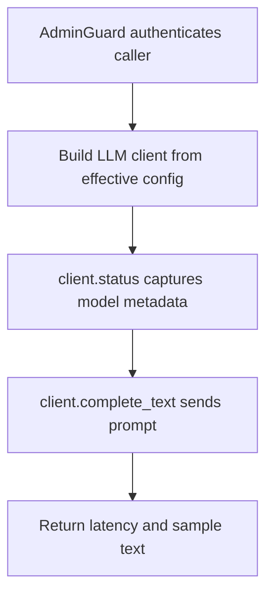

# POST /v1/llm/test

## Summary
Run an admin-only prompt completion against the configured LLM provider.

## Handler
- Rust handler: `llm_test`
- Route registration: `src/routes.rs::build_router`
- Authentication: AdminGuard

## Path Parameters
None.

## Query Parameters
None.

## JSON Body Parameters
Schema: `LlmTestRequest`

| Field | Type | Requirement | Description |
| --- | --- | --- | --- |
| prompt | string | optional, default ping | Prompt sent to the configured LLM provider. |

## Response
Schema: `LlmTestResponse`

| Field | Type | Description |
| --- | --- | --- |
| ok | boolean | True when the test call completed. |
| model | string | Model used. |
| latency_ms | integer | Provider latency. |
| usage | object? | Real provider token counts (`input_tokens`, `cached_input_tokens`, `output_tokens`, `reasoning_output_tokens`, `total_tokens`) when reported. |
| sample | string | Generated text sample. |

## Errors and Access Rules
- Malformed JSON or missing required runtime fields returns 400.
- Owner-scoped endpoints return 403 when the authenticated principal cannot access the requested owner.
- Store, Meilisearch, or LLM failures are returned through the shared ApiError JSON envelope.

## Internal Logic Call Graph

