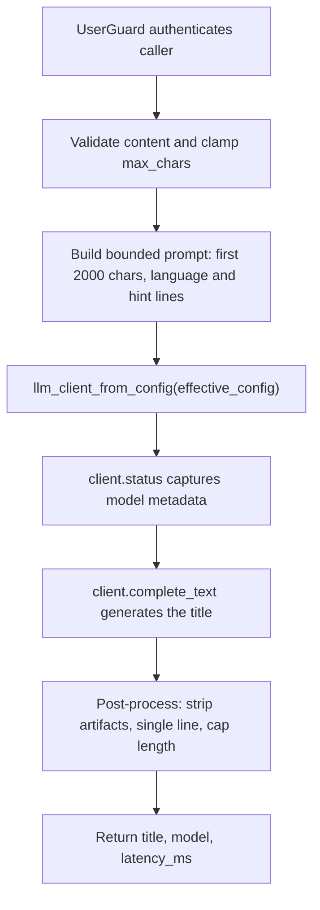

# POST /v1/llm/title

## Summary
Summarize arbitrary text content into a single concise title using the main RAG LLM provider (`RAG_LLM_PROVIDER` / `RAG_LLM_MODEL` — the same routing as `/v1/rag/*`, not the analysis provider).

## Handler
- Rust handler: `llm_title`
- Route registration: `src/routes.rs::build_router`
- Authentication: UserGuard

## Path Parameters
None.

## Query Parameters
None.

## JSON Body Parameters
Schema: `LlmTitleRequest`

| Field | Type | Requirement | Description |
| --- | --- | --- | --- |
| content | string | required, non-empty | Text to summarize. Only the first 2000 characters are sent to the model. |
| max_chars | integer | optional, default 80 | Soft cap on the returned title length; clamped to [20, 200] and enforced on the cleaned output. |
| language | string | optional | Language hint (e.g. "English", "Simplified Chinese"). When omitted the title matches the content language. |
| hint | string | optional | User-supplied draft or keywords the model should refine into the title. |

## Response
Schema: `LlmTitleResponse`

| Field | Type | Description |
| --- | --- | --- |
| title | string | Cleaned single-line title: quote/markdown/"Title:" artifacts stripped, trailing period removed, capped at `max_chars`, `Untitled` fallback when the model returns nothing usable. |
| model | string | Model reported by the provider status probe. |
| latency_ms | integer | Provider completion latency in milliseconds. |
| usage | object? | Real provider token counts (`input_tokens`, `cached_input_tokens`, `output_tokens`, `reasoning_output_tokens`, `total_tokens`) when reported. |

## Errors and Access Rules
- Malformed JSON or missing required runtime fields returns 400.
- Empty or whitespace-only `content` returns 400 (`content is required`).
- Owner-scoped endpoints return 403 when the authenticated principal cannot access the requested owner.
- Store, Meilisearch, or LLM failures are returned through the shared ApiError JSON envelope.

## Internal Logic Call Graph

