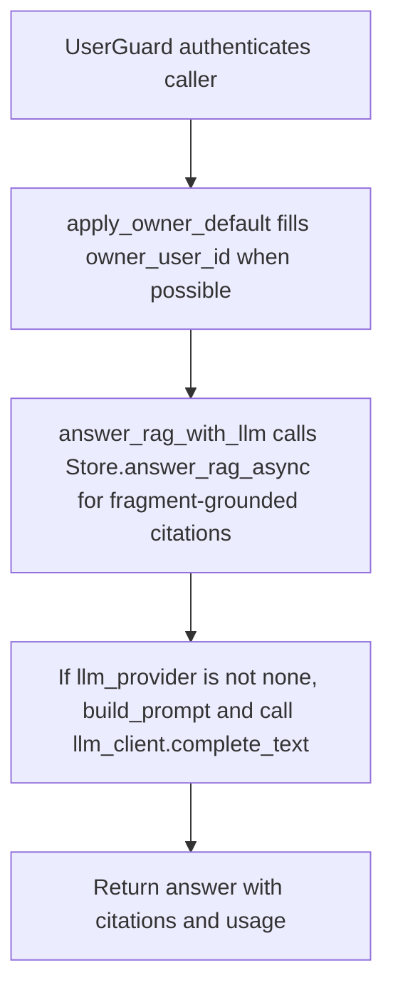

# POST /v1/rag/answer

## Summary
Answer a question using active fragment retrieval results and the configured LLM provider when enabled.

## Handler
- Rust handler: `rag_answer`
- Route registration: `src/routes.rs::build_router`
- Authentication: UserGuard; owner default may apply

## Path Parameters
None.

## Query Parameters
None.

## JSON Body Parameters
Schema: `RagAnswerRequest`

| Field | Type | Requirement | Description |
| --- | --- | --- | --- |
| question | string | required | Question to answer. |
| mode | string | optional, default auto | Retrieval mode selector. |
| session_id | string | optional | Session to associate with the answer. |
| owner_user_id | string | optional, auth default may apply | Owner scope. |
| debug | boolean | optional, default false | Request debug data from retrieval. |

## Response
Schema: `RagAnswerResponse`

| Field | Type | Description |
| --- | --- | --- |
| answer_id | string | Answer id. |
| trace_id | string | Retrieval trace id. |
| answer | string | Generated or store-provided answer. |
| citations | Citation[] | Grounding citations from retrieval fragments. |
| usage | object | LLM/backend usage metadata. |

### Citation Fields
| Field | Type | Description |
| --- | --- | --- |
| uri | string | Fragment context URI used as evidence. |
| source_id | string? | Source identifier when the fragment came from a source document. |
| revision_id | string? | Source revision identifier when present. |
| title | string | Fragment title. |
| quote | string | Quoted fragment text used for grounding. |
| score | number | Retrieval score. |

## Errors and Access Rules
- Malformed JSON or missing required runtime fields returns 400.
- Owner-scoped endpoints return 403 when the authenticated principal cannot access the requested owner.
- Default RAG retrieval searches only active fragments; source documents are not directly searched.
- Store, Meilisearch, or LLM failures are returned through the shared ApiError JSON envelope.

## Internal Logic Call Graph

