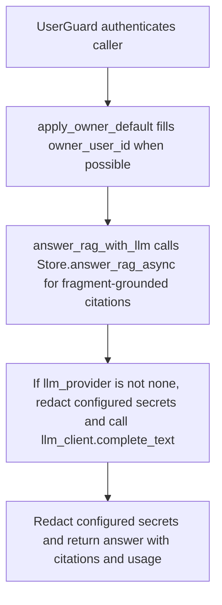

# POST /v1/rag/answer

## Summary
Answer a question using active fragment retrieval results and the configured LLM provider when enabled. Citations preserve source, page, block, geometry, artifact, and fragment-offset provenance for UI highlighting.

## Handler
- Rust handler: `rag_answer`
- Route registration: `src/routes.rs::build_router`
- Authentication: UserGuard; owner default may apply

## Path Parameters
None.

## Query Parameters
None.

## JSON Body Parameters
Schema: `RagAnswerRequest`

| Field | Type | Requirement | Description |
| --- | --- | --- | --- |
| question | string | required | Question to answer. |
| mode | string | optional, default auto | Retrieval mode selector. |
| session_id | string | optional | Session to associate with the answer. |
| owner_user_id | string | optional, auth default may apply | Owner scope. |
| debug | boolean | optional, default false | Request debug data from retrieval. |

## Response
Schema: `RagAnswerResponse`

| Field | Type | Description |
| --- | --- | --- |
| answer_id | string | Answer id. |
| trace_id | string | Retrieval trace id. |
| answer | string | Generated or store-provided answer after configured-secret redaction. |
| citations | Citation[] | Grounding citations from retrieval fragments after configured-secret redaction. |
| usage | object | LLM/backend usage metadata. |

### Usage Fields
| Field | Type | Description |
| --- | --- | --- |
| provider | string | LLM provider that generated the answer. |
| model | string | Model name. |
| latency_ms | integer | Generation latency. |
| backend | string | Store backend that served retrieval. |
| grounded | boolean | True when the answer was grounded in retrieved citations. |
| input_tokens | integer? | Real prompt token count reported by the provider. |
| cached_input_tokens | integer? | Cached prompt tokens (subset of `input_tokens`). |
| output_tokens | integer? | Real completion token count reported by the provider. |
| reasoning_output_tokens | integer? | Reasoning tokens (subset of `output_tokens`). |
| total_tokens | integer? | Provider-reported total, or `input + output` when absent. |

Token fields are present whenever the upstream provider reports them
(OpenAI Responses body `usage`, Codex SSE `response.completed` event);
consumers should fall back to estimation only when they are absent.

### Citation Fields
| Field | Type | Description |
| --- | --- | --- |
| uri | string | Fragment context URI used as evidence. |
| node_kind | string? | Usually `fragment` for default RAG retrieval. |
| retrieval_role | string? | Usually `fragment` for default RAG retrieval. |
| source_id | string? | Source identifier when the fragment came from a source document. |
| revision_id | string? | Source revision identifier when present. |
| source_document_uri | string? | Full source document URI for explicit read/traceback operations. |
| source_title | string? | Parent source document title when known. |
| block_type | string? | Parser block type, such as `text`, `table`, `image`, or `equation`. |
| page_idx | integer? | Zero-based page index from parser metadata when available. |
| bbox | JSON? | Parser-provided bounding box for source highlighting when available. |
| section_path | string[] | Section hierarchy for the fragment. |
| heading_level | integer? | Heading level for heading-derived fragments. |
| asset_refs | string[] | Parser asset references, such as extracted image paths. |
| artifact_refs | ParseArtifactRef[] | Parse artifact references attached to the fragment. |
| fragment_index | integer? | Zero-based fragment index within the source document. |
| char_start | integer? | Fragment start character offset in the source document. |
| char_end | integer? | Fragment end character offset in the source document. |
| checksum | string? | Fragment checksum. |
| title | string | Fragment title. |
| quote | string | Quoted fragment text used for grounding. |
| score | number | Retrieval score. |

## Errors and Access Rules
- Malformed JSON or missing required runtime fields returns 400.
- Owner-scoped endpoints return 403 when the authenticated principal cannot access the requested owner.
- Default RAG retrieval searches only active fragments; source documents are not directly searched.
- The generated prompt includes each citation's source title, `page_idx`, `block_type`, `section_path`, URI, and quote. Configured secrets are redacted before provider submission and from the complete response.
- Citation `source_document_uri` is metadata only. Full source document bodies are readable only through explicit `GET /v1/fs/read` with ACL checks.
- Store, Meilisearch, or LLM failures are returned through the shared ApiError JSON envelope.

## Internal Logic Call Graph

