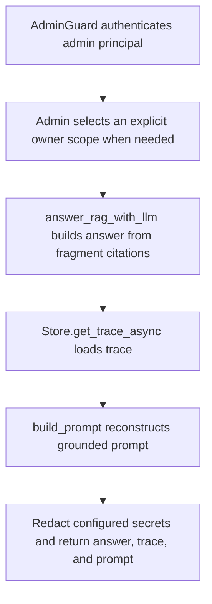

# POST /v1/rag/debug

## Summary
Return a fragment-grounded RAG answer plus its trace and prompt preview for debugging. The nested answer uses the same provenance-rich citation shape as `/v1/rag/answer`.

## Handler
- Rust handler: `rag_debug`
- Route registration: `src/routes.rs::build_router`
- Authentication: AdminGuard required

## Path Parameters
None.

## Query Parameters
None.

## JSON Body Parameters
Schema: `RagAnswerRequest`

| Field | Type | Requirement | Description |
| --- | --- | --- | --- |
| question | string | required | Question to answer. |
| mode | string | optional, default auto | Retrieval mode selector. |
| session_id | string | optional | Session to associate with the answer. |
| owner_user_id | string | optional, auth default may apply | Owner scope. |
| debug | boolean | optional, default false | Request debug data from retrieval. |

## Response
Schema: `JsonValue`

| Field | Type | Description |
| --- | --- | --- |
| answer | RagAnswerResponse | Fragment-grounded answer payload after configured-secret redaction. |
| trace | TraceRecord | Retrieval trace used for the answer after configured-secret redaction. |
| prompt | string | Grounded prompt preview built from fragment citations after configured-secret redaction. |

## Errors and Access Rules
- Missing or invalid bearer authentication returns 401.
- Authenticated non-admin principals return 403 because the response contains a grounded prompt and detailed trace.
- Malformed JSON or invalid request fields returns 400 after authorization.
- Debug output is based on the same default fragment-only RAG retrieval as /v1/rag/answer.
- The prompt preview includes citation source title, `page_idx`, `block_type`, `section_path`, URI, and quote.
- Trace stages may include admin-only raw index/filter details after ordinary secret redaction.
- The complete response is redacted again before serialization, including
  configured auth, Meilisearch, OpenAI, and Codex credentials.
- Store, Meilisearch, or LLM failures are returned through the shared ApiError JSON envelope.

## Internal Logic Call Graph

