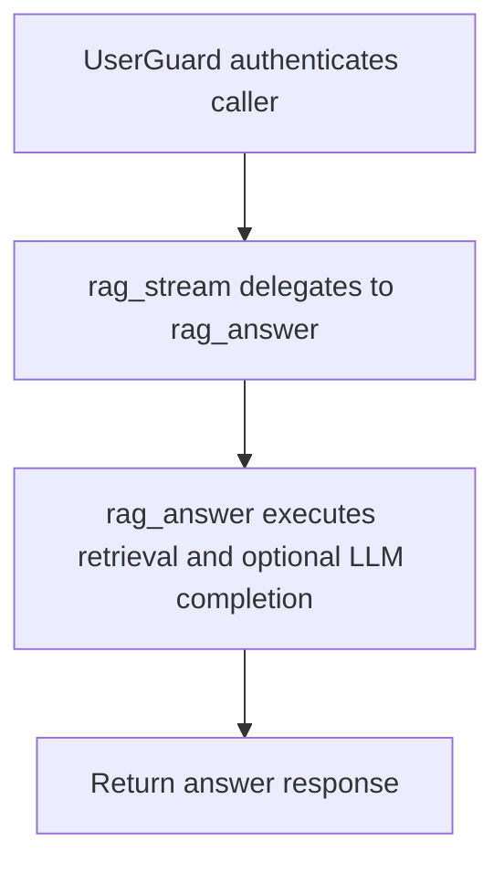

# POST /v1/rag/stream

## Summary
Streaming-compatible alias that currently returns the same JSON response as /v1/rag/answer.

## Handler
- Rust handler: `rag_stream`
- Route registration: `src/routes.rs::build_router`
- Authentication: UserGuard; owner default may apply

## Path Parameters
None.

## Query Parameters
None.

## JSON Body Parameters
Schema: `RagAnswerRequest`

| Field | Type | Requirement | Description |
| --- | --- | --- | --- |
| question | string | optional | Question to answer. |
| mode | string | optional, default auto | Retrieval mode selector. |
| session_id | string | optional | Session to associate with the answer. |
| owner_user_id | string | optional, auth default may apply | Owner scope. |
| debug | boolean | optional, default false | Request debug data from retrieval. |

## Response
Schema: `RagAnswerResponse`

| Field | Type | Description |
| --- | --- | --- |
| answer_id | string | Answer id. |
| trace_id | string | Retrieval trace id. |
| answer | string | Generated or store-provided answer. |
| citations | Citation[] | Grounding citations. |
| usage | object | LLM/backend usage metadata. |

## Errors and Access Rules
- Malformed JSON or missing required runtime fields returns 400.
- Owner-scoped endpoints return 403 when the authenticated principal cannot access the requested owner.
- Store, Meilisearch, or LLM failures are returned through the shared ApiError JSON envelope.

## Internal Logic Call Graph

## Internal Logic Notes
- Despite the route name, the current handler delegates to rag_answer and returns JSON.
