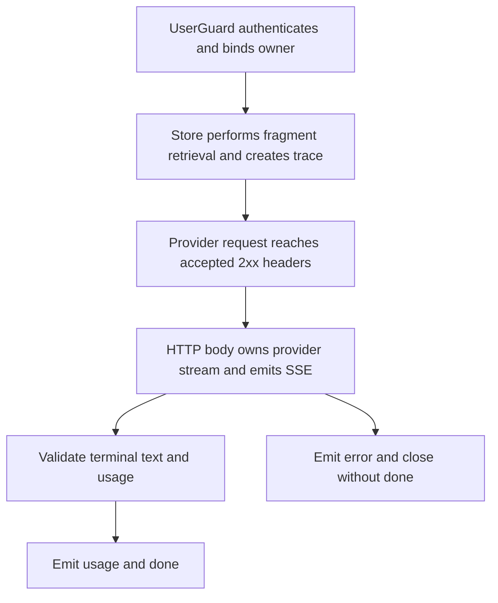

# POST /v1/rag/stream

## Summary

Runs the same authorized fragment retrieval as `/v1/rag/answer`, then returns
the answer incrementally as server-sent events (SSE). Provider response bodies
are read incrementally and are owned by the HTTP response body, so disconnecting
the client cancels unread upstream work.

## Handler

- Rust handler: `rag_stream`
- Route registration: `src/routes.rs::build_router`
- Authentication: `UserGuard`; owner default may apply

## Query Parameters

| Field | Values | Default | Description |
| --- | --- | --- | --- |
| `format` | `sse`, `json` | `sse` | `json` is the deprecated compatibility path and returns the unchanged `/v1/rag/answer` schema. |

Unknown formats return the normal `400 validation_error` JSON envelope before
streaming starts. Content negotiation through `Accept` does not silently select
the compatibility response.

## JSON Body Parameters

Schema: `RagAnswerRequest`

| Field | Type | Requirement | Description |
| --- | --- | --- | --- |
| `question` | string | required | Question to answer. |
| `mode` | string | optional, default `auto` | Retrieval mode selector. |
| `session_id` | string | optional | Session to associate with the answer. |
| `owner_user_id` | string | optional, auth default may apply | Owner scope. |
| `debug` | boolean | optional, default `false` | Request debug data from retrieval. |

## SSE Response

Successful streaming responses use `Content-Type: text/event-stream`. Every
`data:` value is one JSON object. Events are emitted in this order:

1. exactly one `meta`;
2. zero or more `citation` events in deterministic retrieval order;
3. one or more `delta` events when answer text is available;
4. exactly one `usage` after validated provider completion;
5. exactly one `done`.

| Event | JSON data |
| --- | --- |
| `meta` | `{ "answer_id", "trace_id", "provider", "model", "backend", "grounded" }` |
| `citation` | One `Citation` object, not an array wrapper. |
| `delta` | `{ "text": "incremental answer text" }` |
| `usage` | Provider/model/backend/latency metadata plus reported token fields when available. |
| `done` | `{ "answer_id", "trace_id" }` |
| `error` | The standard `{ "error": { "code", "message", "details" } }` envelope. |

If an error occurs after response headers or deltas were sent, the stream emits
one `error` event and closes without `usage` or `done`. Already-emitted deltas
cannot be retracted. Errors found before streaming starts retain their normal
HTTP status and JSON response envelope.

Configured secrets and credential-shaped values are redacted statefully across
provider delta boundaries. Citation, metadata, usage, and error JSON is passed
through the same configured-secret policy as ordinary JSON responses.

## Compatibility JSON Response

`POST /v1/rag/stream?format=json` delegates to the unchanged
`/v1/rag/answer` implementation and returns `RagAnswerResponse`. It also sends:

```text
Deprecation: @1784073600
Link: </v1/rag/answer>; rel="successor-version"
```

The structured date is 2026-07-15 00:00:00 UTC and follows RFC 9745.

Both compatibility headers are included in the CORS exposed-header list so
browser `fetch` clients can inspect them.

New clients should use `/v1/rag/answer` when they require one buffered JSON
document.

## Client Example

Because this endpoint is `POST`, browser `EventSource` is not directly
applicable. Use a streaming `fetch` reader or an HTTP client that does not
buffer the response. A curl example is provided at
`examples/rag_stream.sh`.

```sh
NOWLEDGE_URL=http://127.0.0.1:14242 \
NOWLEDGE_TOKEN="$TOKEN" \
sh examples/rag_stream.sh "What changed?"
```

## Errors and Access Rules

- Malformed JSON or missing required runtime fields returns 400 before SSE starts.
- Owner mismatch returns 403 before SSE starts; the requested owner always comes from authenticated server policy.
- Default retrieval searches only active fragments; source documents are not directly searched.
- Full source bodies remain available only through explicit ACL-checked ContextFS reads.
- A client disconnect drops the provider response; the service does not run a detached producer.
- Provider retries are allowed only before a successful response is accepted. A body error after accepted 2xx headers is terminal and is never retried.

## Internal Logic Call Graph


