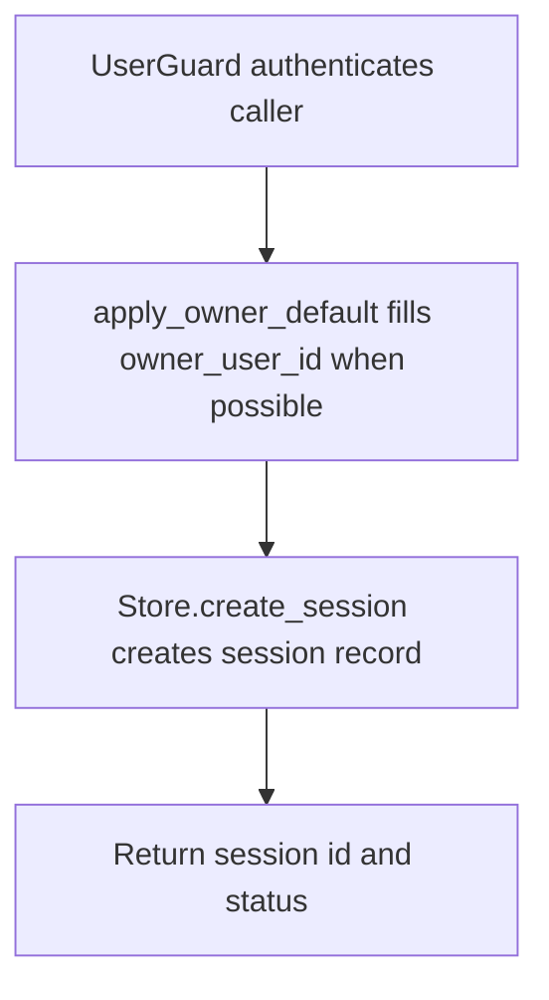

# POST /v1/sessions

## Summary
Create a conversation/session record for an owner.

## Handler
- Rust handler: `create_session`
- Route registration: `src/routes.rs::build_router`
- Authentication: UserGuard; owner default may apply

## Path Parameters
None.

## Query Parameters
None.

## JSON Body Parameters
Schema: `SessionCreateRequest`

| Field | Type | Requirement | Description |
| --- | --- | --- | --- |
| owner_user_id | string | optional, auth default may apply | Owner for the session. |
| title | string | optional | Session title. |

## Response
Schema: `SessionResponse`

| Field | Type | Description |
| --- | --- | --- |
| session_id | string | Session id. |
| status | string | Session status. |

## Errors and Access Rules
- Malformed JSON or missing required runtime fields returns 400.
- Owner-scoped endpoints return 403 when the authenticated principal cannot access the requested owner.
- Store, Meilisearch, or LLM failures are returned through the shared ApiError JSON envelope.

## Internal Logic Call Graph

