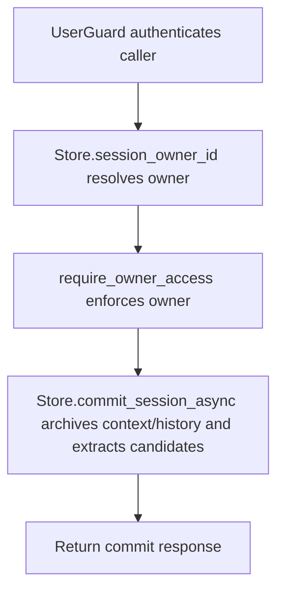

# POST /v1/sessions/{session_id}/commit

## Summary
Commit a session into durable context/history and optionally extract insights.

## Handler
- Rust handler: `commit_session`
- Route registration: `src/routes.rs::build_router`
- Authentication: UserGuard; session owner enforced

## Path Parameters
| Name | Type | Description |
| --- | --- | --- |
| session_id | string | Session identifier. |

## Query Parameters
None.

## JSON Body Parameters
Schema: `SessionCommitRequest`

| Field | Type | Requirement | Description |
| --- | --- | --- | --- |
| extract_insights | boolean | optional, default true | Extract insight candidates from the session. |
| archive_context | boolean | optional, default true | Archive session content into context storage. |

## Response
Schema: `SessionCommitResponse`

| Field | Type | Description |
| --- | --- | --- |
| session_id | string | Committed session id. |
| archive_uri | string? | Context archive URI when created. |
| history_event_ids | string[] | History events emitted from the commit. |
| insight_candidate_ids | string[] | Insight candidates extracted. |
| memory_diff_ids | string[] | Memory diffs generated. |

## Errors and Access Rules
- Malformed JSON or missing required runtime fields returns 400.
- Owner-scoped endpoints return 403 when the authenticated principal cannot access the requested owner.
- Store, Meilisearch, or LLM failures are returned through the shared ApiError JSON envelope.

## Internal Logic Call Graph

