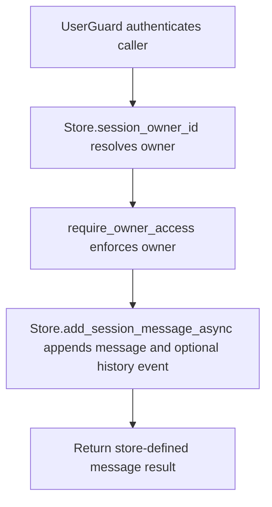

# POST /v1/sessions/{session_id}/messages

## Summary
Append a message to an existing session and optionally write it to history.

## Handler
- Rust handler: `add_session_message`
- Route registration: `src/routes.rs::build_router`
- Authentication: UserGuard; session owner enforced

## Path Parameters
| Name | Type | Description |
| --- | --- | --- |
| session_id | string | Session identifier. |

## Query Parameters
None.

## JSON Body Parameters
Schema: `SessionMessageRequest`

| Field | Type | Requirement | Description |
| --- | --- | --- | --- |
| role | string | optional | Message role such as user or assistant. |
| content | string | optional | Message content. |
| write_history_event | boolean | optional, default false | Also write a history event for the message. |

## Response
Schema: `SessionMessageResponse`

| Field | Type | Description |
| --- | --- | --- |
| ... | object | Store-defined message append result. |

## Errors and Access Rules
- Malformed JSON or missing required runtime fields returns 400.
- Owner-scoped endpoints return 403 when the authenticated principal cannot access the requested owner.
- Store, Meilisearch, or LLM failures are returned through the shared ApiError JSON envelope.

## Internal Logic Call Graph

