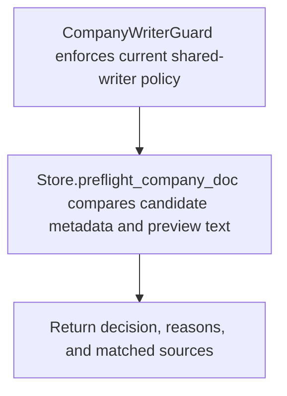

# POST /v1/state/company-docs/preflight

## Summary
Evaluate a company document candidate for duplicate/similar source handling before creating a revision.

## Handler
- Rust handler: `preflight_doc`
- Route registration: `src/routes.rs::build_router`
- Authentication: CompanyWriterGuard (`company_writer` or admin by default; temporary legacy shared-writer mode may apply)

## Path Parameters
None.

## Query Parameters
None.

## JSON Body Parameters
Schema: `CompanyDocPreflightRequest`

| Field | Type | Requirement | Description |
| --- | --- | --- | --- |
| title | string | optional | Candidate document title. |
| source_uri | string | optional | Original document URI. |
| content_type | string | optional | MIME type or logical content type. |
| text_preview | string | optional | Preview text used for similarity checks. |
| checksum | string | optional | Content checksum used to detect duplicates. |
| tags | string[] | optional, default [] | Document tags; at most `RAG_MAX_TAGS_PER_ITEM`, each at most `RAG_MAX_TAG_BYTES` UTF-8 bytes. |
| scope | string | optional | Document visibility or business scope. |
| similarity_threshold | number | optional, default 0.82 | Threshold used to flag similar existing sources. |

## Response
Schema: `CompanyDocPreflightResponse`

| Field | Type | Description |
| --- | --- | --- |
| decision_id | string | Preflight decision id. |
| recommended_action | string | Recommended ingest/create action. |
| confidence | number | Decision confidence. |
| matched_sources | object[] | Potentially matching sources. |
| reasons | string[] | Decision reasons. |

## Errors and Access Rules
- Missing or invalid bearer authentication returns 401.
- Authenticated principals without `company_writer` or admin permission return 403 unless the temporary `RAG_ALLOW_LEGACY_SHARED_WRITER=true` compatibility switch is active.
- Malformed JSON or invalid request fields returns 400 after authorization.
- Excess tags return 400 `validation_error` with `details.field=tags`; an
  oversized tag uses `details.field=tags[i]`. Validation happens before store
  mutation.
- Authorization denials and store success/failure emit structured audit events with keyed identifiers correlated by the response `X-Request-Id`.
- Store, Meilisearch, or LLM failures are returned through the shared ApiError JSON envelope.

## Internal Logic Call Graph

