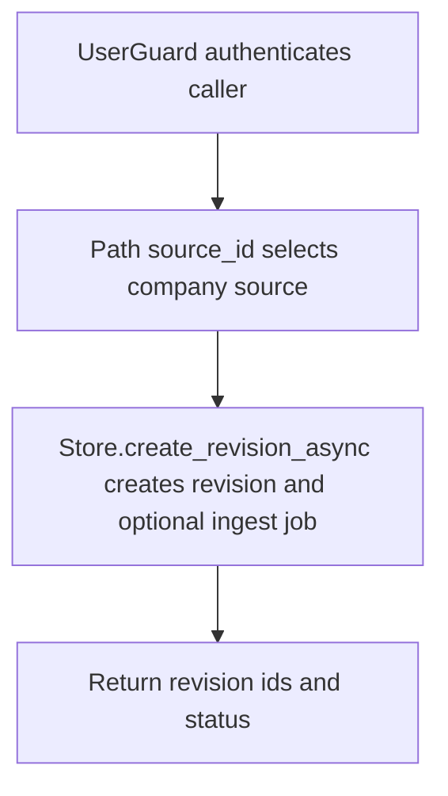

# POST /v1/state/company-docs/{source_id}/revisions

## Summary
Create a staged company document revision and optionally schedule ingest work. Retrieval fragments are materialized when a revision is activated.

## Handler
- Rust handler: `create_revision`
- Route registration: `src/routes.rs::build_router`
- Authentication: UserGuard

## Path Parameters
| Name | Type | Description |
| --- | --- | --- |
| source_id | string | Company document source identifier. |

## Query Parameters
None.

## JSON Body Parameters
Schema: `CreateRevisionRequest`

| Field | Type | Requirement | Description |
| --- | --- | --- | --- |
| preflight_decision_id | string | optional | Preflight decision to attach to this revision. |
| title | string | optional | Revision title. |
| source_uri | string | optional | Canonical source URI. |
| content | string | optional | Revision body content. |
| checksum | string | optional | Content checksum. |
| change_note | string | optional | Human-readable reason for the revision. |
| ingest | boolean | optional, default true | Whether to return an ingest job id. Source document and fragment materialization happen on activation. |
| force_create | boolean | optional, default false | Create a revision even if dedupe checks find a match. |
| idempotency_key | string | optional | Client deduplication key. |

## Response
Schema: `CreateRevisionResponse`

| Field | Type | Description |
| --- | --- | --- |
| source_id | string | Company source id. |
| revision_id | string | New revision id. |
| status | string | Revision status. |
| history_event_id | string? | History event id when emitted. |
| ingest_job_id | string? | Ingest job id when ingest is true. |

## Errors and Access Rules
- Malformed JSON or missing required runtime fields returns 400.
- Owner-scoped endpoints return 403 when the authenticated principal cannot access the requested owner.
- Use the activate endpoint to store the full `SourceDocument`, create retrieval fragments, and supersede older fragments for the same source.
- Store, Meilisearch, or LLM failures are returned through the shared ApiError JSON envelope.

## Internal Logic Call Graph

