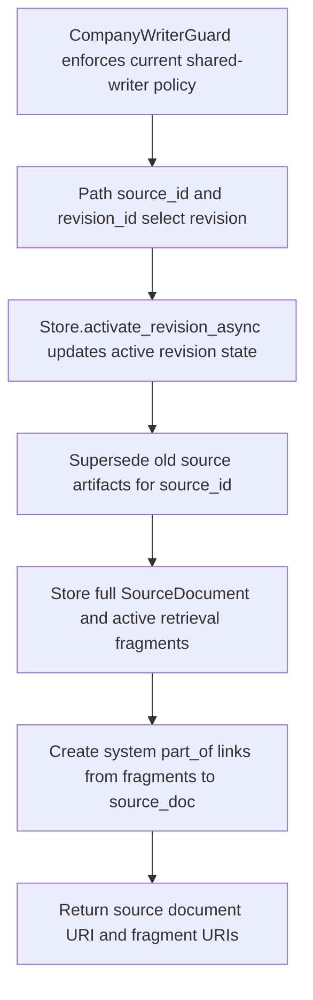

# POST /v1/state/company-docs/{source_id}/revisions/{revision_id}/activate

## Summary
Activate a company document revision, store the full source document, and publish active retrieval fragments.

## Handler
- Rust handler: `activate_revision`
- Route registration: `src/routes.rs::build_router`
- Authentication: CompanyWriterGuard (`company_writer` or admin by default; temporary legacy shared-writer mode may apply)

## Path Parameters
| Name | Type | Description |
| --- | --- | --- |
| source_id | string | Company document source identifier. |
| revision_id | string | Company document revision identifier. |

## Query Parameters
None.

## JSON Body Parameters
Schema: `ActivateRevisionRequest`

| Field | Type | Requirement | Description |
| --- | --- | --- | --- |
| reason | string | optional | Reason recorded with activation. |
| deactivate_previous | boolean | optional, default true | Compatibility flag. Activating a revision supersedes prior source artifacts for the same source. |

## Response
Schema: `ActivateRevisionResponse`

| Field | Type | Description |
| --- | --- | --- |
| source_id | string | Company source id. |
| active_revision_id | string | Activated revision id. |
| previous_revision_id | string? | Previously active revision when present. |
| history_event_id | string? | History event id when emitted. |
| source_document_uri | string | Full source document URI. The source document is not searchable by default. |
| fragment_uris | string[] | Active fragment context URIs generated for retrieval. |
| context_uris | string[] | Alias of `fragment_uris` for compatibility. |

## Errors and Access Rules
- Missing or invalid bearer authentication returns 401.
- Authenticated principals without `company_writer` or admin permission return 403 unless the temporary `RAG_ALLOW_LEGACY_SHARED_WRITER=true` compatibility switch is active.
- Malformed JSON or invalid request fields returns 400 after authorization.
- Authorization denials and store success/failure emit structured audit events correlated by the response `X-Request-Id`; identifiers are keyed, and caller-provided activation reasons are represented only by an allowlisted code plus keyed fingerprint.
- Activating a new revision supersedes old active source documents, fragments, and `part_of` links for the same `source_id`.
- Retrieval searches the generated fragments only; the source document is stored for explicit read/traceback.
- Store, Meilisearch, or LLM failures are returned through the shared ApiError JSON envelope.

## Internal Logic Call Graph

