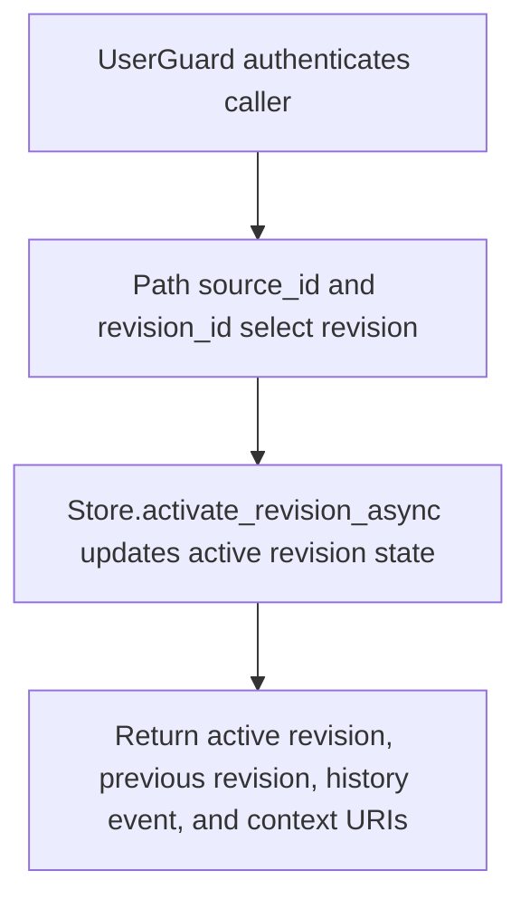

# POST /v1/state/company-docs/{source_id}/revisions/{revision_id}/activate

## Summary
Activate a company document revision and optionally deactivate the prior active revision.

## Handler
- Rust handler: `activate_revision`
- Route registration: `src/routes.rs::build_router`
- Authentication: UserGuard

## Path Parameters
| Name | Type | Description |
| --- | --- | --- |
| source_id | string | Company document source identifier. |
| revision_id | string | Company document revision identifier. |

## Query Parameters
None.

## JSON Body Parameters
Schema: `ActivateRevisionRequest`

| Field | Type | Requirement | Description |
| --- | --- | --- | --- |
| reason | string | optional | Reason recorded with activation. |
| deactivate_previous | boolean | optional, default true | Deactivate the previously active revision. |

## Response
Schema: `ActivateRevisionResponse`

| Field | Type | Description |
| --- | --- | --- |
| source_id | string | Company source id. |
| active_revision_id | string | Activated revision id. |
| previous_revision_id | string? | Previously active revision when present. |
| history_event_id | string? | History event id when emitted. |
| context_uris | string[] | Context URIs affected by activation. |

## Errors and Access Rules
- Malformed JSON or missing required runtime fields returns 400.
- Owner-scoped endpoints return 403 when the authenticated principal cannot access the requested owner.
- Store, Meilisearch, or LLM failures are returned through the shared ApiError JSON envelope.

## Internal Logic Call Graph

