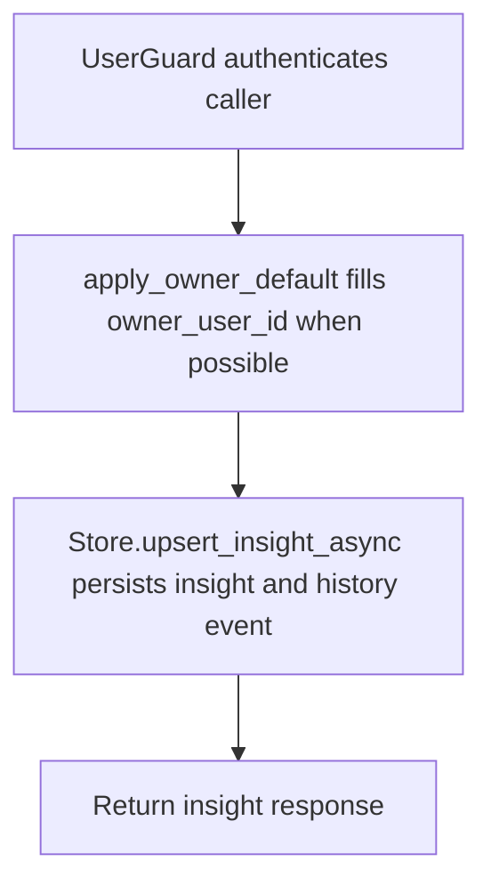

# POST /v1/state/insights

## Summary
Create or merge an insight record and emit a history/context reference.

## Handler
- Rust handler: `upsert_insight`
- Route registration: `src/routes.rs::build_router`
- Authentication: UserGuard; owner default may apply

## Path Parameters
None.

## Query Parameters
None.

## JSON Body Parameters
Schema: `InsightUpsertRequest`

| Field | Type | Requirement | Description |
| --- | --- | --- | --- |
| owner_user_id | string | optional, auth default may apply | Owner for the insight. |
| insight_type | string | optional | Insight category. |
| title | string | optional | Insight title. |
| statement | string | optional | Grounded insight statement. |
| evidence_text | string | optional | Evidence text recorded with the insight. |
| source_refs | SourceRef[] | optional, default [] | Evidence source references. |
| confidence | number | optional, default 0.7 | Confidence score. |
| salience | number | optional, default 0.5 | Salience score. |
| privacy | string | optional, default private | Privacy label. |
| merge_policy | string | optional, default merge | Merge behavior for similar insights. |
| idempotency_key | string | optional | Client deduplication key. |

## Response
Schema: `InsightResponse`

| Field | Type | Description |
| --- | --- | --- |
| insight | InsightRecord | Stored insight. |
| history_event_id | string | Mutation event id. |
| context_uri | string | Insight context URI. |

## Errors and Access Rules
- Malformed JSON or missing required runtime fields returns 400.
- Owner-scoped endpoints return 403 when the authenticated principal cannot access the requested owner.
- Store, Meilisearch, or LLM failures are returned through the shared ApiError JSON envelope.

## Internal Logic Call Graph

