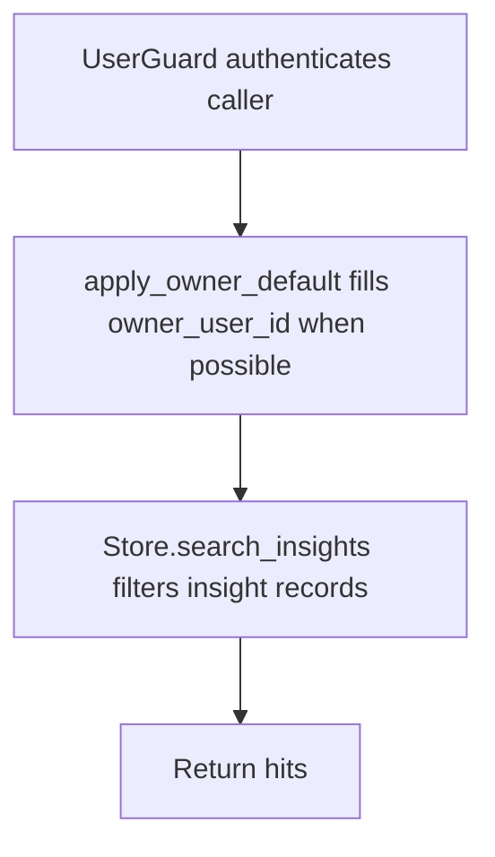

# POST /v1/state/insights/search

## Summary
Search stored insights by query, owner, type, status, and limit.

## Handler
- Rust handler: `search_insights`
- Route registration: `src/routes.rs::build_router`
- Authentication: UserGuard; owner default may apply

## Path Parameters
None.

## Query Parameters
None.

## JSON Body Parameters
Schema: `InsightSearchRequest`

| Field | Type | Requirement | Description |
| --- | --- | --- | --- |
| query | string | optional | Full-text insight query. |
| owner_user_id | string | optional, auth default may apply | Owner scope. |
| insight_types | string[] | optional, default [] | Restrict by insight type. |
| status | string | optional, default active | Insight status filter. |
| limit | integer | optional, default 10 | Maximum hits returned; must not exceed `RAG_MAX_SEARCH_LIMIT`. |

## Response
Schema: `InsightSearchResponse`

| Field | Type | Description |
| --- | --- | --- |
| hits | InsightRecord[] | Matching insights. |

## Errors and Access Rules
- Malformed JSON or missing required runtime fields returns 400.
- `limit` above `RAG_MAX_SEARCH_LIMIT` returns 400 `validation_error` with
  `details.field=limit` before search.
- Owner-scoped endpoints return 403 when the authenticated principal cannot access the requested owner.
- Store, Meilisearch, or LLM failures are returned through the shared ApiError JSON envelope.

## Internal Logic Call Graph

