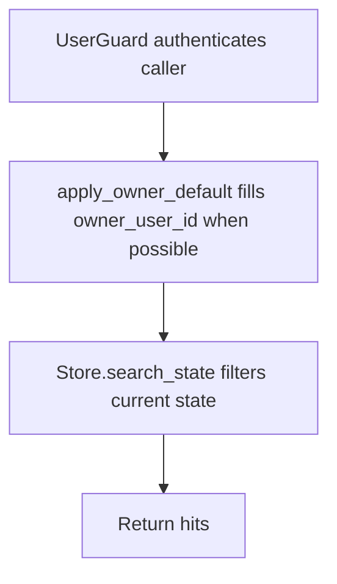

# POST /v1/state/search

## Summary
Search current state facts by query, type, owner, status, and limit.

## Handler
- Rust handler: `search_state`
- Route registration: `src/routes.rs::build_router`
- Authentication: UserGuard; owner default may apply

## Path Parameters
None.

## Query Parameters
None.

## JSON Body Parameters
Schema: `StateSearchRequest`

| Field | Type | Requirement | Description |
| --- | --- | --- | --- |
| query | string | optional | Full-text state search query. |
| state_types | string[] | optional, default [] | Restrict search to selected state types. |
| owner_user_id | string | optional, auth default may apply | Owner scope. |
| status | string | optional, default active | State item status filter. |
| limit | integer | optional, default 10 | Maximum hits returned. |

## Response
Schema: `StateSearchResponse`

| Field | Type | Description |
| --- | --- | --- |
| hits | StateItem[] | Matching state items. |

## Errors and Access Rules
- Malformed JSON or missing required runtime fields returns 400.
- Owner-scoped endpoints return 403 when the authenticated principal cannot access the requested owner.
- Store, Meilisearch, or LLM failures are returned through the shared ApiError JSON envelope.

## Internal Logic Call Graph

