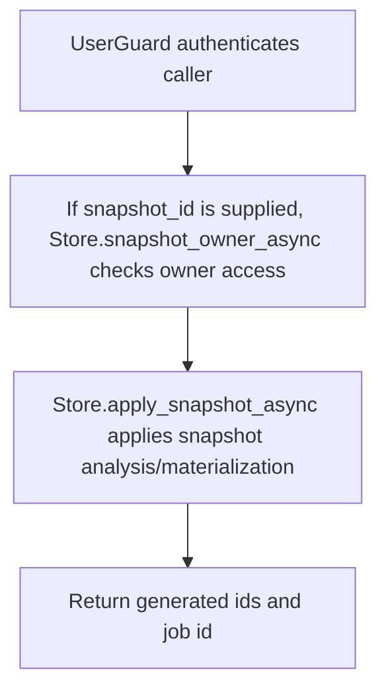

# POST /v1/state/structured/datasets/{dataset_key}/apply-snapshot

## Summary
Apply a structured snapshot to generate summaries, state items, insight candidates, and context nodes.

## Handler
- Rust handler: `apply_snapshot`
- Route registration: `src/routes.rs::build_router`
- Authentication: UserGuard; snapshot owner checked when snapshot_id is supplied

## Path Parameters
| Name | Type | Description |
| --- | --- | --- |
| dataset_key | string | Dataset key. |

## Query Parameters
None.

## JSON Body Parameters
Schema: `ApplySnapshotRequest`

| Field | Type | Requirement | Description |
| --- | --- | --- | --- |
| snapshot_id | string | optional | Structured snapshot to apply. When supplied, owner access is checked. |
| analysis_window | string | optional | Analysis window hint. Store defaults to last_4_periods when omitted. |
| llm_mode | string | optional, default none | LLM mode for snapshot analysis. |
| materialize_context | boolean | optional, default true | Whether to materialize context nodes from the snapshot. |
| idempotency_key | string | optional | Client deduplication key. |

## Response
Schema: `ApplySnapshotResponse`

| Field | Type | Description |
| --- | --- | --- |
| snapshot_id | string | Applied snapshot id. |
| summary_ids | string[] | Generated summary ids. |
| state_item_ids | string[] | State item ids generated or touched. |
| insight_candidate_ids | string[] | Insight candidate ids generated. |
| context_uris | string[] | Materialized context URIs. |
| job_id | string | Apply job id. |

## Errors and Access Rules
- Malformed JSON or missing required runtime fields returns 400.
- Owner-scoped endpoints return 403 when the authenticated principal cannot access the requested owner.
- Store, Meilisearch, or LLM failures are returned through the shared ApiError JSON envelope.

## Internal Logic Call Graph

