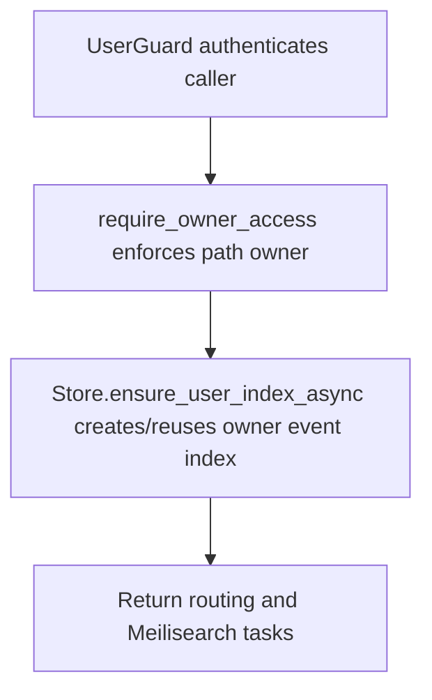

# PUT /v1/history/users/{owner_user_id}/event-index

## Summary
Ensure the private history event index and optional personal context index exist for one owner.

## Handler
- Rust handler: `ensure_user_event_index`
- Route registration: `src/routes.rs::build_router`
- Authentication: UserGuard; path owner enforced

## Path Parameters
| Name | Type | Description |
| --- | --- | --- |
| owner_user_id | string | Owner user id whose private history index is targeted. |

## Query Parameters
None.

## JSON Body Parameters
Schema: `EnsureUserEventIndexRequest`

| Field | Type | Requirement | Description |
| --- | --- | --- | --- |
| force_reapply_settings | boolean | optional, default false | Reapply index settings even when the stored settings hash matches. |
| create_personal_context_index | boolean | optional, default true | Must remain true; the companion personal context index is a required routing invariant. |
| schema_version | integer | optional | When supplied, must equal the server's current event-index schema version. |

## Response
Schema: `UserEventIndexResponse`

| Field | Type | Description |
| --- | --- | --- |
| index | UserEventIndex | Persisted owner index metadata. |
| routing | EventIndexRouting | Resolved event and personal context index routing. |
| meili_task_uids | string[] | Settings/indexing tasks created in Meilisearch. |

## Errors and Access Rules
- Malformed JSON or missing required runtime fields returns 400.
- Setting `create_personal_context_index=false` or requesting a non-current
  `schema_version` returns 400 before any index mutation.
- Owner-scoped endpoints return 403 when the authenticated principal cannot access the requested owner.
- Store, Meilisearch, or LLM failures are returned through the shared ApiError JSON envelope.

## Internal Logic Call Graph

